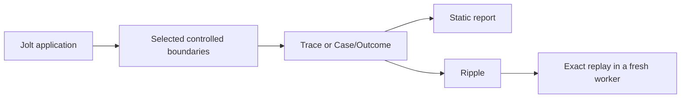

# jolt-sim

`jolt-sim` is experimental tooling for testing and inspecting Jolt programs.
It gives a program controlled boundaries, recorded evidence, and repeatable
cases. It does not make a general claim that an ordinary Jolt program is model
checked.

Use it when you need to do one of these jobs:

| Job | Start here |
| --- | --- |
| Inspect a saved trace or Case/Outcome | [Ripple](viewer/README.md) |
| Replay one saved Case/Outcome in a fresh worker | [Ripple](viewer/README.md) |
| Run a real HTTP, SQLite, and TCP outbox by hand | [Outbox workbench](examples/outbox-workbench/README.md) |
| Step a small Broadcast cluster, drop a link, and heal it | [Broadcast workbench](examples/maelstrom-broadcast-workbench/README.md) |
| Render a saved document as static HTML | [Static reports](report/README.md) |
| Work on the simulator or run a test lane | [Development roadmap](docs/ROADMAP.md) |

## Mental model

The application keeps its normal Jolt APIs. A scenario or harness selects the
controlled boundaries and records the result. Ripple and the static report read
that result. They do not create a second scheduler or application model.

A **trace** records a cooperative model run. A **Case/Outcome** records one
ordinary-runtime case and its result. Only a validated Case/Outcome can be
replayed. An **experiment plan** is an inspection-only description. It cannot
run code.

## What is available now

- A deterministic cooperative model kernel and trace replay.
- Controlled ordinary-runtime execution at selected future, clock, and native
  effect boundaries.
- Process-isolated cases, retained artifacts, and optional Hegel generation.
- Ripple, static HTML reports, and two end-to-end example workbenches.

This is pre-release research code. Its APIs, controller ABI, and document
schemas can change without a compatibility layer.

## Read the right document

The short guides above are for use. The following documents hold the detailed
contracts, proof scope, and open limits:

- [Documentation map](docs/README.md)
- [Current implementation status and boundaries](docs/research/IMPLEMENTATION-STATUS-AND-BOUNDARIES.md)
- [Ripple implementation details](docs/research/RIPPLE-IMPLEMENTATION-DETAILS.md)
- [Project-local Mycelium vision and decision register](docs/research/MYCELIUM-PROJECT-VISION.md)

The Mycelium document is a non-binding vision. It records options and decision
points. It is not a committed API or implementation plan.
