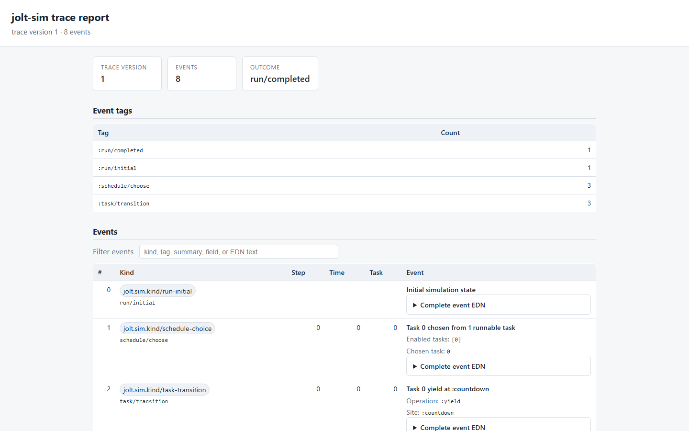
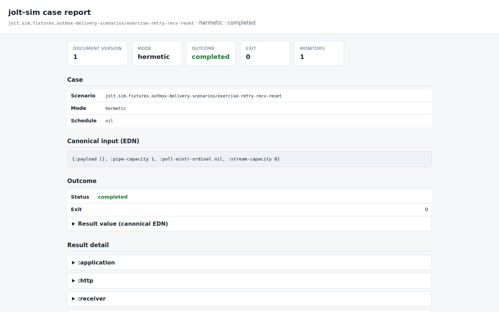

# jolt-sim

`jolt-sim` is an experimental deterministic simulation and concurrency-testing
toolkit for Jolt. The production runtime should expose only small control and
event hooks; schedule search, virtual time, fault injection, replay, monitoring,
and simulated worlds belong here.

> [!WARNING]
> This is public pre-release research code, not a supported release. APIs,
> controller ABIs, trace schemas, and model contracts may change or be replaced
> without compatibility shims or a deprecation period. Git history is the only
> compatibility archive until the first real release establishes a versioned
> public boundary.

## Development baseline and CI

Current development targets `casselc/jolt` commit
`9fc64f93eba8b56a319f91bb1a322e2efced9c70`, based on upstream Jolt 0.5.20,
with Chez Scheme 10.4.1. The full suite requires the special Jolt simulation
image from that commit; an ordinary Jolt image can run only the controller-free
portion of the suite.

Public CI builds that exact simulation image. Linux x86_64/aarch64 and macOS
x86_64/arm64 run the main suite plus the controller-poison, pointer-loan,
scheduler-deadline, POSIX/HTTP integration, TCP/bencode framing, the
HTTP/SQLite/TCP outbox application, and fresh-process case gates. Hegel
schedule generation/shrinking, the TCP/bencode real/sim property lane, and the
outbox workload/capacity/poll-fault lane run on Linux x86_64. Windows x86_64
runs the main, controller-poison, pointer-loan, and scheduler-deadline gates,
but not the fresh-process supervisor: the current Jolt process host uses a POSIX shell plus
`waitpid`/`kill`. The TCP framing alias also remains POSIX-only because it
statically loads the POSIX scenario adapter; adding it to Windows requires a
separate portability witness rather than assuming that load chain is portable.
The Windows ARM64 lane currently runs the controller-free source suite because
its Chez toolchain intentionally provides a source runtime but no
GNU-compatible kernel development pack for linking the simulation image. That
narrower lane is nonblocking until its first hosted runs establish a stable
baseline.

No CI lane carries historical prerelease controller implementations. When the
current Jolt fork changes, this repository advances its one pinned development
baseline and remints the affected contracts and tests in place.

## Current foundation

- a pure cooperative-model scheduler with virtual integer time;
- deterministic full enabled-action BFS for cooperative models, with
  budget-bearing canonical state, bounded state admission, frozen invariant
  evidence, replayable shortest witnesses, and isolated byte-array branches;
- seeded and scripted task selection;
- immutable exactly-once operation completions with deterministic wakeups;
- byte-stable, versioned EDN traces and exact replay;
- a pure fold-based offline monitor API;
- a trace-grammar monitor for ordering, step, time, and terminal invariants;
- dynamic discovery of the sim-image controller ABI without making ordinary
  Jolt images depend on it; and
- a `run-controlled`/`defsim` adapter that preserves the application body
  unchanged while gating ordinary future starts, substituting registered
  FFI/native effects, observing real native execution, or mixing modeled
  boundaries with guarded native fallback;
- capped lexicographic enumeration of exact top-level future-admission plans
  and a fresh-process supervisor that runs each case with a deadline, canonical
  result transport, and bounded termination/reaping;
- an optional Hegel adapter that either selects from an ordered schedule domain
  or directly generates a count-based permutation, shrinks a failing choice,
  and exactly replays it in another fresh worker;
- a pure transport-neutral fault-plan director with closed canonical plans,
  deterministic shallow matching, match/firing ordinals, bounded activation,
  first-eligible priority, and exact evidence that separates activation from
  actual firing;
- a deterministic POSIX fault frontend that validates one closed captured
  `EINTR` outcome algebra up front, interposes only target-exact `poll(2)`,
  retains replay-checked attempt evidence, and delegates every nonfiring poll
  through the original modeled handler outside its serialization lock;
- a deterministic native-memory world with configurable ABI widths and byte
  order, exact bounds/lifetime failures, copy-safe byte buffers, owned C
  strings, and leak snapshots;
- a deterministic SQLite handler model plus a real/sim parity fixture that
  executes unchanged `jdbc.core` application code;
- a descriptor-driven POSIX IPv4 loopback handler model whose dual-use fixture
  executes unchanged public `jolt.net` code against either real sockets or a
  hermetic in-memory stream, including partial I/O, directional half-close,
  finite stream and self-pipe backpressure, target-exact `poll(2)`, and the real
  public poller/self-pipe wake machinery;
- an ordinary HTTP-plus-SQLite application fixture whose unchanged
  `jolt-http` handler uses public `jdbc.core`, returns a byte-exact BLOB, and
  passes both real-socket/real-SQLite parity and one shared hermetic
  POSIX/SQLite native boundary.

## Optional static reports

The [`report`](report/) dependency root turns either a validated cooperative
trace plus already-computed monitor decisions or one validated ordinary-runtime
Case/Outcome document into a self-contained deterministic HTML report. It is
packaged separately so ordinary simulator consumers do not pull in Selmer or
its Jolt host-support dependencies. Human-facing Case/Outcome sections use the
contract's public restoration API while the complete canonical replay document
remains available in a collapsed section. The same data-only view models are
intended to feed the later live web/GTK viewer; rendering does not run monitor
functions or introduce another evidence schema.

From the report dependency root, select the document schema explicitly:

```sh
jolt -M:trace-report TRACE.edn [OUTPUT.html]
jolt -M:case-report CASE-OUTCOME.edn [OUTPUT.html]
```

Committed examples make both views inspectable without first running a test
campaign:

- [cooperative scheduler trace](report/examples/cooperative-countdown-trace.html)
  ([source EDN](report/examples/cooperative-countdown-trace.edn));
- [whole-application HTTP/SQLite/outbox retry Case/Outcome](report/examples/outbox-retry-case-outcome.html)
  ([source EDN](report/examples/outbox-retry-case-outcome.edn)).

[](report/examples/cooperative-countdown-trace.html)

[](report/examples/outbox-retry-case-outcome.html)

The HTML is generated through `trace->view-model` or
`case-outcome->view-model`, never hand-mocked. See the
[example regeneration guide](report/examples/) for exact commands and the
boundary between a retained witness and the owning campaign's evidence claim.

### Executed scenario coverage

This is an execution manifest, not a namespace-import checklist. A row records
only the application surfaces and modes exercised by a durable gate.

| Scenario | Ordinary library surface | Real lane | Simulated lane | Current boundary |
| --- | --- | --- | --- | --- |
| SQLite BLOB round trip | `jdbc.core`, `db.sqlite`, `jolt.ffi`, byte arrays | System SQLite | Scripted SQLite over FFI memory | Sequential statements; local workspace gate |
| POSIX loopback stream/poller | `jolt.net`, `jolt.ffi` | Not in the durable gate | Modeled sockets, pipe, and `poll(2)` | Finite stream/self-pipe capacity; captured `EINTR`; optional alarm-backed virtual timeout wake |
| HTTP Hello World | `jolt-http`, `jolt-tcp`, `jolt.net`, `jolt.ffi` | Not in the durable gate | Modeled POSIX loopback | One request; public CI, no faults |
| HTTP SQLite BLOB | `jolt-http`, `jolt-tcp`, `jolt.net`, `jdbc.core`, `db.sqlite`, `jolt.ffi`, byte arrays | Host sockets plus system SQLite | Shared FFI-memory, POSIX, and SQLite worlds | One request at one-byte capacities plus one captured first-poll `EINTR`; local gate, no generated schedule/fault search |
| Length-framed TCP bencode echo | `teensyp.server`, `teensyp.client`, `teensyp.buffer`, `jolt.bytes`, `jolt.bencode`, `jolt.net`, `jolt.ffi` | Host loopback parity witness | Modeled POSIX loopback and native memory | Pipelined requests, finite stream/self-pipe capacities, captured `EINTR`, and Hegel-generated UTF-8; no half-close or concurrent clients |
| HTTP SQLite outbox delivery | `jolt-http`, `jdbc.core`, `db.sqlite`, `teensyp.server/client`, `jolt.bytes`, `jolt.bencode`, `jolt.net`, `jolt.ffi` | Host HTTP/TCP sockets plus system SQLite | Shared FFI-memory, POSIX, exact-plan SQLite, and one shared virtual clock | Ordinary, scoped-reset retry, clean close/reopen, post-COMMIT process-exit/recovery, cancellation-before-ack, and one-operation absolute-deadline witnesses; Hegel varies payload bytes, capacities, poll interruption, admission, and a closed terminal-action axis; no general scheduler, power-loss, or exactly-once claim |
| Maelstrom Echo | `jolt.maelstrom` node/handler code | JSON-lines lane reviewed but not integrated | Deterministic memory transport | FIFO/history integrity only; no nemesis or liveness claim |

These capabilities belong to two deliberately different execution tracks:

- **Cooperative-model execution** runs a finite transition system through the
  pure kernel. Its canonical state, enabled actions, transitions, virtual time,
  and bounds can support explicitly scoped reachability or completeness claims.
- **Ordinary-runtime controlled execution** runs unchanged Jolt code through
  the controller hooks and modeled/native effect seam. Its current scheduler
  serially admits a declared number of top-level future bodies. It supports
  controlled execution and exact case replay within the documented hook and
  escape bounds; it is not model checking of arbitrary Jolt programs.

Hegel supplies generated cases and shrinking around either suitable boundary.
It is not itself the scheduler or an exhaustive-state explorer.

The cooperative explicit-state API is deliberately low level:
`jolt.sim.kernel/machine`, `machine-actions`, `machine-apply`,
`machine-status`, and `machine-projection` expose the same transition owner used
by `kernel/run`; `jolt.sim.explore-states/explore-states` branches over every
enabled action and deduplicates canonical budget-bearing states. A finite
capacity-one mailbox control now explores same-tick reply, timeout, and cancel
claims, proves first-writer-wins plus exactly-once terminal cleanup, and retains
a replayable deliberately buggy double-cleanup witness.

Its bounded completeness statement applies only to deterministic,
side-effect-free cooperative steps and invariants over value-semantic state and
a nonbinding state cap. Machine branches copy accepted byte-array leaves, but
closed-over mutation, host entropy, clocks, native I/O, and other effects remain
outside that proof boundary. This is not a claim that ordinary Jolt executions
are exhaustively model checked. The separate controlled-runtime track remains
the route for unchanged application and library code.

The runtime adapter accepts one exact current controller contract, presently
prerelease ABI 6. All current controller vars are required. If every var is
absent, `available?` returns false for an ordinary released Jolt image. A
partial namespace, stale or future ABI number, or any descriptor that differs
from the literal current shape fails closed as
`:jolt.sim.runtime/abi-incompatible`.

The contract exposes one composite install/restore: `install-controller!`
accepts one callback map keyed `:future`, `:ffi`, and `:clock` and returns a
single restore token; `restore-controller!` accepts that one token, atomically
and in strict LIFO order. Each callback controller has its documented arity:
the future lifecycle controller is arity 3, and the FFI and clock controllers
are arity 2.

The current lifecycle has `:spawn`, `:start`, `:finish`, `:cancel`, `:exit`, and
`:abort`. A task owns a worker from `:spawn` until exactly one `:exit`/`:abort`;
`:finish`/`:cancel` settle its future but do **not** release that ownership, so
a cancelled running worker remains owned until `:exit`. After the body returns,
cleanup waits a bounded interval (`:drain-timeout-ms`, default 2000) for every
hooked-future worker to release ownership and every lifecycle callback to
finish before restoration. One composite restore atomically reinstates the
prior future, FFI, and clock controller state. If the scope cannot drain, the
controllers remain installed and the session is poisoned rather
than restored unsafely. Late terminal/drain events are accepted after closure;
new `:spawn`/`:start` events fail closed. Body exceptions are rethrown unchanged
only after drainage and restoration succeed.

Every controlled run installs one composite controller covering FFI and clock
interception. Exact nested descriptor version 6 requires Boolean
`:capture-native-error?` and an exact `:varargs-after` boundary on foreign
calls and admits all 16 current native operations, including scoped
`:borrow-byte-array`/`:release-byte-array` and the mutating `:read-array!`.
A foreign argument type is a primitive keyword only: recursive by-value
aggregate argument types are not accepted, because current Jolt scalar
metadata is exact. Variadic calls are instead identified by `:varargs-after`:
nil for fixed-arity calls, or a positive integer no greater than the
argument-type count naming the first variadic position. Handlers are
configured via `:ffi-handlers`, keyed by `[:native-operation operation]` or
`[:foreign-function c-symbol-string argument-types return-type blocking?
capture-native-error? varargs-after]`. Five- and six-element foreign-function
keys are unambiguous configuration shorthands for capture `false`/varargs
`nil` and explicit-capture/varargs `nil` respectively; supplying any two
spellings that canonicalize to the same seven-element key for one binding is
rejected. Map membership, including a `nil` value, defines handled. A captured
handler must return `[native-result error-code]`.

The clock descriptor is version 1 with one operation, `:mono-nanos`, returning
exact-integer nanoseconds and declared nondecreasing. `run-controlled` accepts
an optional `:clock` config: an arity-2 `(descriptor proceed)` controller. When
omitted, a pass-through clock proceeds every intercepted `:mono-nanos` so real
OS monotonic time remains available. Drain deadlines always use the resolved
private `supervisor-mono-nanos`, never the installed clock, so a frozen virtual
clock still times out.

`jolt.sim.clock/virtual-clock` is the reusable stateful controller for tests and
scenarios that need explicit virtual time. Its `controller` drives both
`System/nanoTime` and `jolt.host/mono-nanos` through the existing compiler ABI.
It also owns exactly-once deadline alarms for modeled blocking resources. Time
never advances automatically: an explorer or scenario examines
`next-deadline` and advances only when its runnable-task policy permits.

The current contract also exposes a scoped, owner-thread, single-use native
`proceed` continuation. `run-controlled` selects routing with `:ffi-mode`:

- `:hermetic` is the default. The current two-argument `(descriptor proceed)`
  controller is installed, ignores `proceed`, registered handlers
  substitute results, and an unhandled effect is blocked before OS access.
- `:observe` accepts no `:ffi-handlers` and proceeds every
  intercepted call through its exact native branch while recording the route.
- `:hybrid` lets a registered handler substitute its result, or explicitly
  request native routing for its exact call; a handler miss (or an explicit
  request) proceeds through the exact native branch unless model-owned
  resource provenance makes that fallback unsafe.

Every successful run returns the `:effects` vector plus a positionally
correlated `:effect-trace`. Each trace entry records the
exact descriptor, selected mode, and actual `:handler`, `:native`, or
`:blocked` route. A native exception raised by `proceed` keeps ordinary
application semantics: unchanged code may catch it, and it is not relabeled as
a controller failure. Handler, descriptor, and routing-policy failures remain
latched fail closed even when application code catches their immediate throw.

Controller numbering is explicitly prerelease-only. ABI 7, 8, and later
development bumps replace the current contract in place; historical contracts
remain available in Git but do not accumulate as supported runtime branches.
At the first real public release, the externally visible controller and nested
FFI/schema numbering will be consolidated and reset to version 1,
establishing the first compatibility boundary.

Hybrid handler functions must classify results explicitly with
`jolt.sim.runtime/substitute`, `jolt.sim.runtime/modeled-resource`, or
`jolt.sim.runtime/proceed`; a literal `nil` handler-map value remains an
explicit nil substitution. `substitute` is
an assertion that the result is a non-resource scalar/value; known non-null
pointer results (`alloc`, `string->ptr`, pointer-typed `read`, and foreign
`:pointer`/`:void*` results) reject that classification. A handled
`borrow-byte-array` is stricter: it must return a positive `modeled-resource`,
because core requires a usable borrowed pointer and cannot accept a null
substitution.
Integer handles returned under
generic scalar types such as `:int`/`:uptr` cannot be identified from ABI types
alone, so their handler packs must use `modeled-resource`. The latter marks
a non-negative numeric pointer, descriptor, or handle as model-owned. Its
optional positive span covers a half-open interval; `alloc` and
`borrow-byte-array` infer their span from the intercepted arguments when it is
omitted. Before a hybrid miss can proceed, the adapter truncates numeric
arguments with the same toward-zero rule as core and rejects any result inside
a model-owned interval. A resource's domain determines which argument
positions are checked: a `:pointer`-domain resource -- one whose descriptor
identifies it as returning a live pointer
(`alloc`, `borrow-byte-array`, `string->ptr`, a pointer-typed `read`, or a
foreign call with a `:pointer`/`:void*` return type) -- is checked only at its
exact pointer-bearing argument positions for that call (derived from
`:argument-types` for a foreign call, or a fixed per-operation table for the
16 native operations, including `write`'s value slot when its type is
`:pointer`/`:void*`/`:iptr`/`:uptr`), so an ordinary scalar argument -- a
length, size, or status code -- that numerically coincides with a live fake
pointer does not block an unrelated call. An `:opaque`-domain resource -- a
numeric handle the ABI types cannot identify as a pointer, such as an integer
handle returned under `:int`/`:uptr` -- remains checked against every argument
position, as before this distinction existed. The ledger is per run and
conservative for the whole scope (no early retirement yet), so extension packs
should allocate fake resources from disjoint high ranges. This guard prevents
a fake pointer/handle returned by one modeled call from reaching a later real
native call; it is not general taint tracking for scalar values or pointers
encoded inside byte arrays.

For example, this models allocation while allowing an unchanged library's
other FFI calls to reach the real host:

```clojure
(sim/run-controlled
 {:ffi-mode :hybrid
  :ffi-handlers
  {[:native-operation :alloc]
   (fn [_descriptor] (sim/modeled-resource 1042000000 4096))}}
 library/exercise-native-api)
```

A matching modeled `free`/read/write boundary should also be registered by a
real handler pack; otherwise use of that fake range on a handler miss is
reported as `:jolt.sim.runtime/modeled-resource-native-fallback` before native
execution.

A registered hybrid handler may also return `jolt.sim.runtime/proceed`
instead of a classified result, explicitly requesting native routing for that
exact call rather than an ordinary unhandled-descriptor miss. The same
modeled-resource provenance guard still runs first, so a selected proceed is
blocked exactly like a miss would be when the call's live arguments already
alias a registered resource; only when the guard passes does the real native
`proceed` continuation run. `proceed` is rejected outright outside `:hybrid`
routing. The resulting `:effect-trace` entry uses `:route :native` and still
carries the selecting handler's identity, distinguishing an explicit
selection from an ordinary miss.

`jolt.sim.runtime/with-additional-resources` composes with `substitute` or
`modeled-resource` to register zero or more further modeled resources
alongside a handler's primary classified result, each an exact `{:base
nonnegative-integer :span positive-integer}` map. This covers APIs such as
POSIX `pipe`, whose primary return is an ordinary status while separate
output pointers receive modeled descriptors:

```clojure
(fn [_descriptor]
  (sim/with-additional-resources
   (sim/substitute 0)
   [{:base 9000 :span 1} {:base 9100 :span 1}]))
```

Every addition is validated before any of them -- or the primary resource --
reaches the ledger; a malformed addition throws immediately and leaves the
ledger completely unchanged. This wrapper does not add resource retirement or
typed resource domains.

The non-restoration case intentionally poisons its process, so its permanent
regression is isolated from the reusable test session:

```sh
/path/to/current-sim/target/sim/jolt -M:runtime-poison-test
```

Descriptor-version 6 retains the scoped byte-array pointer loan and adds the
mutating `:read-array!`. Its dedicated
custom-image gate runs one ordinary `jolt.ffi` fixture first against real native
memory and then unchanged against the deterministic memory handlers, including
nested native access and exception cleanup:

```sh
/path/to/current-sim/target/sim/jolt -M:ffi-pointer-loan-test
```

The adapter still does not discover future counts, choose high-utility
interleavings, or advance virtual time. The pure fault director described below
now owns plan policy and evidence, and the first POSIX frontend consumes it at
the modeled `poll(2)` seam; no runtime-controller fault hook exists yet.
`schedule-plans` can
enumerate the first bounded lexicographic top-level admission permutations, but
that is not Hegel/swarm search, partial-order reduction, or explicit-state
exploration. SQLite and the first POSIX loopback stream, self-pipe, and
readiness wait now have deterministic boundary models; unchanged public
`jolt.net`, `jolt-tcp`, and `jolt-http` code runs over the loopback world in the
current Hello World and HTTP/SQLite fixtures. Real/sim HTTP/SQLite parity and
one deterministic captured `EINTR` retry are live; virtual network faults and
OpenTelemetry export remain open. The traces still do not describe arbitrary
production execution.

### First coarse scripted scheduler (`:future-schedule`)

`run-controlled` accepts an optional `:future-schedule`: a
nonempty vector that is an exact permutation of `0..N-1`, shape-validated
before any controller is installed (so a malformed schedule fails closed on
any image, including an ordinary released one). It drives
`jolt.sim.future-schedule`, the first coarse deterministic scheduler over
**unchanged** ordinary futures, using only the current lifecycle
events -- no new controller hook.

Ordinals are assigned, in arrival order, to accepted `:spawn` events whose
`:parent` is `0`. The current hook also uses parent zero for a future created by
any non-hooked raw thread; it does not expose enough identity to distinguish that
thread from the thunk's thread. This first slice therefore requires a
caller-enforced quiescent scope with exactly one parent-zero spawner. Nested
hooked futures fail closed; competing raw-thread spawners are an explicit
nonclaim. The schedule states the admission order for the accepted ordinals'
*bodies*: an immutable single-use gate is created per ordinal at `:spawn` and
its `:start` blocks on that gate; at most one ordinal's body is admitted at a
time, and the next is released only after the current ordinal's `:finish`.
`:exit` remains worker-ownership/drain evidence, never the advancement
point.

Any of the following aborts every undecided gate (so blocked `:start` calls
fail fast and can still reach `:exit` for drainage) and fails with an `ex-info`
tagged `:jolt.sim.runtime/schedule-error`: a nested spawn, a spawn
beyond the schedule's length, fewer spawns than the schedule declares, a
successfully registered spawn followed by pre-worker `:abort`, an out-of-order
terminal event, or an application cancellation, which is **unsupported** in
this first successful-schedule slice. The first schedule failure is retained
even when application code catches its propagated callback exception.

On success the result map gains `:schedule-events`, a deterministic logical
vector containing only alternating `[:admit ordinal]` and
`[:complete ordinal]` entries. It deliberately excludes racing raw
spawn/start/exit arrival order and global task ids; those remain available in
the unchanged compatibility `:events` field. Repeating one successful script
therefore produces byte-identical scheduler evidence even though raw ids and
worker exit order change.

An optional user `:on-event` still composes. Scheduler validation and start
admission run before the callback. A valid `:finish` reaches the user callback
before releasing the next body, so a callback failure aborts every undecided
gate instead of allowing or stranding later work. Such a user failure remains
a controller-callback error rather than being mislabeled as a schedule
violation.

This scheduler makes **no deadlock-recovery claim**: if the schedule's
admission order is incompatible with how the unchanged thunk's own thread
actually depends on its futures (for example, blocking on an already-spawned
future before the schedule ever lets the future it is waiting on run), the
blocked `:start`/`deref` simply never returns, the same as it would in
unchanged application code. That is a property of the requested order, not a
failure this slice detects or recovers from, and still requires
external/subprocess supervision -- exercised in isolation, not as an
in-process test that would hang the suite:

```sh
/path/to/current-sim/target/sim/jolt -M:future-schedule-poison-test
```

### Fresh-process cases and bounded future-admission enumeration

`jolt.sim.process-explorer` now supplies the external supervision required by
that nonclaim. Despite the prerelease namespace name, this layer is a process
supervisor and case runner; it does not explore an application state graph.
`defsim` vars are marked and retain their original no-argument
form. The original declaration form accepts runtime overrides but no nonnil
scenario input. An optional one-symbol binding form exposes a canonical input
to both the declared configuration and the otherwise ordinary Jolt body:

```clojure
(sim/defsim checkout-race [case]
  {:ffi-handlers (handlers-for (:faults case))}
  (checkout/run! (:workload case)))
```

The generated var records whether it accepts input, so a worker rejects an
incompatible case before invoking the scenario; it never infers that contract
from application exception data. A project can define a worker alias such as:

```clojure
{:aliases
 {:sim-worker
  {:main-opts ["-m" "jolt.sim.explore-worker"]}}}
```

The parent runs outside `run-controlled`. `run-case` carries one optional
canonical `:input` and one optional exact future `:schedule` through a fresh
worker. Supplying both is the basic transport for generated
workload/fault/schedule cases; omitting the schedule installs no future
scheduler:

```clojure
(require '[jolt.sim.process-explorer :as process-explorer])

(process-explorer/run-case
 {:worker-command ["/path/to/current-sim/jolt" "-M:sim-worker"]
  :dir "/absolute/path/to/project"
  :scenario 'my.scenarios/checkout-race
  :input {:workload [[:checkout :order-7]]
          :faults [[:sqlite/busy 1]]}
  :schedule [1 0]
  :startup-timeout-ms 60000
  :timeout-ms 5000})
```

`run-schedule` remains the exact-schedule compatibility wrapper, and `explore`
runs an ordered schedule domain. For example:

```clojure
(require '[jolt.sim.explore :as explore]
         '[jolt.sim.process-explorer :as process-explorer])

(process-explorer/explore
 {:worker-command ["/path/to/current-sim/jolt" "-M:sim-worker"]
  :dir "/absolute/path/to/project"
  :scenario 'my.scenarios/checkout-race
  :schedules (explore/schedule-plans
              {:future-count 3 :max-schedules 6})
  :startup-timeout-ms 60000
  :timeout-ms 5000})
```

The worker command must name the Jolt executable directly or use an exec-style
wrapper. The current Jolt process host reclaims that worker process, not an
arbitrary descendant tree left behind by a shell wrapper.

Each case gets a new operating-system process and a protocol-v2 EDN
request/result file pair. There is no prerelease protocol-v1 compatibility.
Only a namespaced, `defsim`-marked var with an explicit input-contract marker
is invoked. Inputs, completed values, and scenario failures cross the boundary
through the canonical trace value domain; resolution, protocol, contract, and
encoding failures are reported as `:worker-error`. A child that misses its
deadline is sent TERM, then KILL after a bounded grace period, and must be
observed reaped. When `:startup-timeout-ms` is present, the worker publishes a
sideband readiness marker only after request validation, scenario resolution,
and input restoration. Missing that bootstrap deadline is a `:worker-error`
and aborts a Hegel campaign as infrastructure; the independent `:timeout-ms`
starts at readiness, so only a scenario that blocks after its body is admitted
is a shrinkable `:timeout` case. Omitting `:startup-timeout-ms` preserves the
original single-deadline, two-argument worker invocation. Failure to observe
worker death is always an infrastructure exception rather than an ordinary
outcome.

Completed cases remove their private run directory. Every `:failed`,
`:worker-error`, or `:timeout` outcome instead includes an `:artifact-dir` and
retains everything observed there: `request.edn`, `result.edn`, `stdout.log`,
and `stderr.log`. A file the worker never created remains absent, so a spawn
failure, crash, and malformed result remain distinguishable. The exceptional
"worker death not observed" paths also expose `:artifact-dir` in their
exception data and retain the same directory for diagnosis.

`:timeout` deliberately means only “the worker did not exit by its deadline.”
It is not a deadlock proof. General case transport does not itself generate or
interpret workloads and faults: the current plan space is still just serial
admission of a known number of top-level ordinary-future bodies. Nested
futures, competing raw spawners, clocks, synchronization-boundary choices,
fault-plan generation/shrinking and transport frontends, workload shrinking,
and coverage-guided sampling remain later work.

### Optional Hegel selection and shrinking

The `jolt.sim.hegel` namespace is an optional adapter. Activate a
`jolt-hegel` dependency before requiring it; the repository's
`:hegel-explore-test` alias pins the peeled v0.1.2 commit and demonstrates the
setup. A property can let Hegel select one ordered plan, run it in the
fresh-process supervisor, and shrink a failure:

```clojure
(require '[hegel.core :as h]
         '[jolt.sim.explore :as explore]
         '[jolt.sim.hegel :as sim-hegel])

(let [plans (explore/schedule-plans
             {:future-count 3 :max-schedules 6})]
  (h/run-test!
   {:test-cases 100
    :database ""
    :derandomize? true
    :name "checkout/future-schedules"
    :verbosity :quiet}
   (fn [_]
     (let [outcome
           (sim-hegel/require-completed!
            (sim-hegel/run-schedule! process-config plans))]
       (when-not (application-invariants-hold? outcome)
         (throw
          (ex-info
           "checkout invariant failed"
           {:hegel/origin "checkout/future-schedules"
            :schedule (:schedule outcome)})))))))
```

The adapter validates the ordered plan set before generation. Hegel owns the
choice and shrink spans; each generated or replayed case still gets a new
worker process. A timeout or application failure can be promoted to a stable
property failure with `require-completed!`, while an application-specific
invariant supplies its own stable failure origin and evidence. A
`:worker-error` instead aborts the Hegel run as infrastructure: dependency,
process bootstrap, and result-protocol failures are not useful shrink targets.

When the future count is known but materializing an explicit plan domain is
undesirable, the property body can generate a schedule directly:

```clojure
(sim-hegel/run-direct-schedule! process-config 8)
```

For `N > 1`, this makes exactly `N - 1` bounded Hegel integer draws as Lehmer
digits and decodes them into one exact permutation in `O(N²)` time. It never
enumerates the `N!` schedule space. `N = 1` uses the constant `[0]` generator
without an integer draw. All-zero digits decode to the identity permutation;
the pinned-engine tests demonstrate an always-failing identity shrink and a
specific real-process reduction from `[1 2 0]` to `[1 0 2]`.

These remain structural shrinking seams, not high-utility distributions.
For an explicit domain, `g/sampled-from` shrinks toward earlier entries, so
callers control the simplification order; a bounded lexicographic prefix is
deterministic but structurally biased toward earlier lexicographic schedules
under a small budget. The pinned Hegel API does not document a distribution
for its integer draws, so the direct generator makes no uniform sampling claim.
Hegel runs cases sequentially; stateful swarm rules,
coverage/resource-order scores, targeted sampling, workload and fault
generation, and partial-order reduction remain separate later work.

### Transport-neutral deterministic fault plans

`jolt.sim.fault` is the single pure policy core shared by future message,
POSIX, SQLite, and other boundary frontends. It validates one ordered vector of
closed rule maps and returns immutable director state. `step` consumes a plain
canonical attempt map and returns the next state plus exact evidence; it never
performs I/O or interprets a rule's opaque outcome:

```clojure
(require '[jolt.sim.fault :as fault])

(def d0
  (fault/director
   [{:id :example/interrupt-first-poll
     :match {:boundary :posix :operation :poll}
     :activation {:on-match 1 :times 1}
     :outcome {:kind :captured-error :errno :eintr}}]))

(fault/step d0
            {:attempt-id [:posix/poll 1]
             :boundary :posix
             :operation :poll})
```

Matching is a shallow top-level subset whose values compare by canonical
projection, so byte arrays compare by content and nested maps compare exactly.
Every matching rule advances its match ordinal. A rule activates at
`:on-match` while it has fewer than the total `:times` firings; the first
activated rule in vector order fires. Evidence records every matching rule's
activation and firing decision plus the chosen rule's global and per-rule
firing ordinals and a fresh copy of its outcome. Plans, attempts, public state,
and returned evidence fail closed outside the stable trace domain.

The director transition is pure; that is the load-bearing reason recorded
history can be checked for internal coherence without claiming protocol
legality. Frontends replay the complete history from the initial director at
construction and snapshot boundaries, an O(N) check. A live call advances only
the next director state in O(1); replaying the whole prefix on every call would
make N calls quadratic and could consume the application's real monotonic
deadline.

This core does not itself simulate errno, delay, loss, partitions, clocks, or
transport behavior. A boundary frontend must construct attempts, interpret only
the outcomes it owns, and retain its real buffer/readiness/ownership semantics.
`jolt.sim.net.posix-fault` is the first such frontend. It accepts only
`{:kind :captured-error :errno :eintr}` rules, requires an exact positive EINTR
value in the supplied target, and rejects every rule before returning a
frontend if either contract is unsatisfied. Every admitted poll receives a
sequential attempt ID and canonical evidence. A firing returns captured
`[-1 EINTR]` without touching modeled poll state; a nonfiring attempt invokes
the original target-exact handler exactly once. Full world and evidence replay
validation occurs at handler-pack and evidence boundaries, while the poll hot
path is independent of history length.

### FFI interception and routing caveats

- **Effects are live in-memory evidence.** The `:effects` vector records each
  exact validated descriptor in arrival order, and
  `:effect-trace` records its route in the same order. Descriptor arguments are
  the live objects that crossed the interception boundary; they may include
  mutable values such as byte arrays, and are not snapshotted or canonicalized.
- **Native work before scope is not intercepted.** A library load or foreign
  function call completed before `run-controlled` installs its controllers has
  already reached the real OS. Defining a lazy `defcfn` before the scope is
  safe; invoking it inside the scope is intercepted before symbol resolution.
- **Raw threads remain outside lifecycle ownership.** Only ordinary
  `future-call` workers emit the current lifecycle events. A raw `Thread.`
  created inside the scope can outlive it undetected and regain uncontrolled OS
  access after restoration. The current lifecycle closes the
  canceled-running-worker gap for hooked futures; it does not claim ownership
  of arbitrary host threads. A scenario that
  creates raw threads or executor tasks must join them before its body returns
  if they can perform FFI; otherwise neither safe restoration nor a complete
  route trace is claimed.
- **A unified causal trace remains later work.** Native descriptors and their
  route decisions are now one correlated log, but lifecycle events remain a
  separate ordered log; correlating a future's task id across both logs is the
  caller's responsibility today.

### Deterministic native memory

`jolt.sim.ffi-memory` supplies handlers for all 16 operations in the current
descriptor-version 6 FFI contract. Owned allocations use aligned fake addresses
backed by immutable byte vectors, so an intercepted pointer can never reach
Chez or the operating system. `:read-array!` copies modeled bytes directly into
the caller's live destination byte array, mirroring the same fail-closed
lifetime/bounds checks as `:read-array`/`:write-array`. A staged
`:borrow-byte-array`/`:release-byte-array` pair
instead aliases a validated live Jolt byte-array window for exactly one
`with-byte-array-pointer` callback; modeled native and ordinary array
mutations remain mutually visible, and access after release fails closed. The
default world is deterministic LP64 little-endian; `:pointer-size`,
`:long-size`, `:byte-order`, `:base-address`, `:alignment`, and the set of
available library names are explicit configuration.

The application body remains ordinary Jolt code:

```clojure
(require '[jolt.sim.ffi-memory :as memory]
         '[jolt.sim.runtime :as sim]
         '[my.library :as library])

(let [world (memory/world)
      run (sim/run-controlled
           {:ffi-handlers (memory/handlers world)}
           library/exercise-native-api)]
  {:result (:result run)
   :effects (:effects run)
   :leaks (memory/leaks world)})
```

`my.library` imports `jolt.ffi`, not `jolt.sim`. The test fixture
`jolt.sim.fixtures.ffi-roundtrip` is executed unchanged against both real
native memory and this world.

`jolt.sim.ffi-memory/hybrid-handlers` returns the same 16 keys pre-classified
for `run-controlled`'s `:hybrid` `:ffi-mode`: `alloc`, `borrow-byte-array`,
`string->ptr`, and a positive pointer-typed `read` each become a
`modeled-resource` spanning their exact live allocation; every other result is
a `substitute`.

This is intentionally a memory substrate, not a model of every C library.
SQLite and the initial POSIX loopback stream provide library-specific handler
packs over the same heap; other native libraries and codecs still require
their own minimal boundary handlers. Scalar `:float` and `:double` memory
reads/writes fail with a distinct
typed error in this first slice (their `sizeof` values are available).
Simulated `loaded?` reports names successfully loaded in the world; it never
re-probes the host loader. Bounds errors, invalid frees, double frees, use after
free, unterminated strings, and leaked live allocations are explicit evidence
rather than native undefined behavior.

### Deterministic POSIX loopback and readiness

`jolt.sim.net.posix-loopback` models the exact foreign descriptors used by the
current POSIX `jolt.net` stack over the same native-memory world. The caller
supplies the live target descriptor, so Linux `nfds_t :size_t` and Darwin
`nfds_t :uint`, `pollfd` offsets, socket constants, and errno values are never
guessed from the host name.

The model owns synthetic IPv4 stream sockets, listener accept queues,
directional byte FIFOs, and self-pipe endpoints. `poll(2)` reports requested
read/write readiness plus unconditional error, hangup, and invalid-fd bits. A
blocking wait registers atomically with its readiness check, releases the world
lock while parked, and recomputes live state after every notification. This is
why an ordinary self-pipe write, connect, stream send, shutdown, or close can
wake it without deadlocking or returning readiness for an unrelated descriptor.

Two fixtures import `jolt.net`, not `jolt.sim`: one exercises stream I/O and
half-close, and the other drives `open-poller`, registration-token succession,
`await-ready`, the wake cursor, removal, and idempotent close. Their harness
installs the handler world underneath the unchanged code:

```sh
/path/to/current-sim/target/sim/jolt -M:posix-loopback-test
```

The default wait continues to use real monotonic elapsed time. A harness may
instead pass a `jolt.sim.clock/virtual-clock` as the fourth `posix/world`
argument and install that same clock's `controller` in `run-controlled`. Finite
`poll` then registers a clock alarm on the same promise as its readiness waiter
and parks without a host timeout. Resource readiness cancels the pending alarm;
virtual advancement wakes an expired poll; either race recomputes live state.
The model never auto-advances because a runnable peer may make the descriptor
ready first.

Each socket receive FIFO has a finite positive capacity (65,536 bytes by
default). A full live peer clears `POLLOUT`; nonblocking `send` captures
`EAGAIN`, and `recv` republishes write readiness after freeing room. The
HTTP-plus-SQLite lane runs at one-byte capacity and proves both partial progress
and an actual would-block/retry without changing application code. The outbox
terminal campaign now installs this same clock underneath the ordinary app and
advances one operation-wide absolute deadline at a named semantic boundary.

Each modeled self-pipe likewise has a finite positive capacity (65,536 bytes by
default). This bounded wake-pipe surface keeps its current short writes atomic:
a write either fits in full or a nonblocking writer captures `EAGAIN`; a full
blocking write fails closed because the model has no blocking pipe-write wait.
`POLLOUT` clears while a live reader FIFO is full and returns after a read. The
focused unchanged `jolt.net` poller lane runs with a one-byte FIFO and proves its
acknowledged close wake followed by the unconditional terminal wake reaches and
correctly accepts the full-pipe `EAGAIN` path. The ordinary HTTP and HTTP/SQLite
lanes also remain correct at one-byte self-pipe capacity without making a
scheduling-dependent claim about which close attempt observes `EAGAIN`.

That same poller fixture now injects captured EINTR on its second native poll.
Unchanged pinned `jolt.net` retries against its existing absolute deadline,
then completes with all sockets, pipes, registrations, memory, and waiters
retired. The HTTP/SQLite fixture injects one first-poll EINTR through the same
frontend while preserving the exact DB-backed response and cleanup evidence.
The reviewed checkpoint passed the poller gate at 3 tests / 69 assertions, the
source-only HTTP/SQLite gate at 1 / 26, and the combined real-plus-sim gate at
1 / 30.

### Deterministic SQLite driver model

`jolt.sim.sqlite` implements the exact 22 foreign-function descriptors used by
the current `db.sqlite` driver over the same deterministic memory world. It is
data-driven rather than a SQL engine: each `sqlite3_prepare_v2` consumes the
next statement plan, verifies the exact SQL, and then verifies typed bound
parameters while serving declared rows, change counts, last-row ids, or a
declared SQLite error.

```clojure
(require '[jolt.sim.runtime :as sim]
         '[jolt.sim.sqlite :as sqlite]
         '[my.app :as app])

(let [world
      (sqlite/world
       [{:sql "PRAGMA foreign_keys=1;"
         :params {} :columns [] :rows []}
        {:sql "select payload from messages where id = ?"
         :params {1 {:type :integer :value 7}}
         :columns ["payload"]
         :rows [[{:type :blob :value (byte-array [0 127 128 255])}]]}])
      run
      (sim/run-controlled
       {:ffi-handlers (sqlite/handlers world)}
       #(app/read-message 7))]
  {:result (:result run)
   :effects (:effects run)
   :clean? (sqlite/clean? world)})
```

`my.app` and its database library import no simulator namespaces. The
integration fixture runs the same `jdbc.core` body against real SQLite, the
hermetic model, and hybrid routing, including nonempty and empty BLOB round
trips, and checks the exact foreign-call sequence and complete
handle/borrowed-memory cleanup:

`jolt.sim.sqlite/hybrid-handlers` returns the same 38 keys pre-classified for
`:hybrid` `:ffi-mode`. Every key substitutes its ordinary scalar/string result
except `sqlite3_column_blob`, whose positive pointer becomes a
`modeled-resource` spanning its exact live BLOB allocation (a null pointer
remains a `substitute`, like every other result); a database fixture run
unchanged through the public `:hybrid` routing path is this repo's end-to-end
witness for that classification.

```sh
export JOLT_SIM_BIN=/path/to/a/sim-enabled/jolt
"$JOLT_SIM_BIN" -M:sqlite-test
"$JOLT_SIM_BIN" -M:sqlite-sim-test
```

These workspace-local aliases expect the `db` checkout to be a sibling of the
canonical `jolt-sim` checkout. They deliberately do not fall back to an older
installed `db`. Public CI does not currently run either alias, so this is
locally verified parity rather than public platform evidence. The first command
proves real/hermetic/hybrid result parity, but resolving
`db` as a normal dependency lets Jolt process its native-library metadata
before the controlled scope begins. The second command adds the `db` source
path without that metadata: it proves the fixture does not need SQLite
native-library startup or loading. It does not claim that every other startup
effect in the process is OS-independent. In both lanes, every application
SQLite call made inside `run-controlled` is intercepted and an unhandled
descriptor fails closed.

This first model intentionally describes sequential statement executions. It
does not parse SQL, simulate SQLite locking or durability, choose concurrent
schedules, or inject step/cleanup failures yet.

### Canonical HTTP plus SQLite vertical slice

`jolt.sim.fixtures.http-sqlite` is an ordinary application fixture: it imports
no simulator namespace. Its synchronous `jolt-http` handler opens an in-memory
database through `jdbc.core`, creates a table, inserts and reads a BLOB
containing `0`, `65`, `127`, `128`, and `255`, and returns the fetched byte
array as an `application/octet-stream` response. The client uses the public
`teensyp.client`/`jolt.net` path and preserves the body byte-exact while parsing
only the fixed HTTP response framing.

The full lane runs that same body first against host sockets and system SQLite,
then under one controlled run whose POSIX and SQLite worlds share one FFI-memory
heap. The source-only lane omits `db`'s native-library metadata and proves the
modeled SQLite calls do not require the system SQLite library to initialize:

```sh
/path/to/current-sim/target/sim/jolt -M:http-sqlite-test
/path/to/current-sim/target/sim/jolt -M:http-sqlite-sim-test
```

Both aliases currently expect the reviewed `db` checkout beside the canonical
`jolt-sim` checkout and are local evidence, not public CI platform evidence.
The gate asserts real/sim response parity, the exact POSIX-plus-SQLite foreign
symbol set, handler-only routing, complete statement-plan consumption, and
clean SQLite handles, sockets, pipes, waiters, resolver allocations, and shared
native memory. Its simulated run additionally fixes both socket receive and
self-pipe capacity at one byte. It proves a capacity-limited stream write,
`EAGAIN`/poll retry, maximum one-byte stream occupancy, and bounded self-pipe
occupancy. Its simulated half also injects one deterministic captured EINTR at
the first poll and proves the unchanged stack recovers. It does not yet claim
concurrent requests, generated schedules or fault plans, database
locking/durability, other native failures, or bounded liveness.

### Length-framed TCP plus bytes and bencode

`jolt.sim.fixtures.tcp-bencode` is another ordinary application fixture with no
simulator import. It uses public `teensyp.server`, `teensyp.client`,
`teensyp.buffer`, `jolt.bytes`, `jolt.bencode`, and `jolt.host` APIs to serve two
pipelined echo requests over a four-byte big-endian length frame. The parser retains an
incomplete prefix/body across reads, drains multiple complete frames already in
one buffer, rejects oversized bodies and trailing codec data, and requires the
bencode cursor to consume the declared body exactly. Like the other application
fixtures in this repository, it is a new fixture built from unchanged ecosystem
libraries, not an unchanged upstream application.

The Hegel lane runs one real-loopback/sim parity witness, then 15 fresh-worker
cases over one-, two-, four-, and eight-byte modeled stream/self-pipe
capacities, selected captured `poll(2)` EINTR ordinals, and discriminating
empty, ASCII, and UTF-8 text. Five additional cases draw shrinkable UTF-8 text
directly from Hegel. Every requested nonnil EINTR ordinal must actually fire;
every stream capacity must be reached and produce backpressure. It checks exact
correlated replies, handler-only FFI routing, capacity and fault evidence, and
complete socket/pipe/native-memory cleanup:

```sh
export JOLT_SIM_BIN=/path/to/current-sim/target/sim/jolt
export JOLT_SIM_PROJECT_DIR=/absolute/path/to/jolt-sim
script/run-hegel-gates.sh tcp-bencode-hegel-test
```

The runner keeps fresh HOME/cache/temp state separate from one complete
`JOLT_GITLIBS` dependency cache, pre-resolves both the parent and nested-worker
aliases, installs the pinned Hegel native library once, and retains its full
gate root and transcript. This avoids turning a missing Git dependency into a
generated counterexample. Set `JOLT_SIM_GATE_PARENT` to choose the parent of
the never-overwritten gate directory.

This is an unchanged-library integration witness, not a replacement TCP or
bencode implementation. The current bencode profile carries UTF-8 text and
integers but does not claim arbitrary binary byte strings. The lane explores
capacity fragmentation and poll interruption; it does not claim half-close
coverage, concurrent clients, admission-order search, a stateful Hegel model,
broad malformed-network generation, load/performance proof, or liveness proof.
Larger self-pipe capacities are configuration coverage until a wake-coalescing
workload pressures each bound. Literal independent wire vectors and every
incomplete frame boundary run via `-M:tcp-bencode-framing-test`. This black-box
application lane does not observe arbitrary ordinary array accesses or claim
any backing-array ownership overlap proof. FFI admission-order schedules and
broader malformed-client generation remain later slices.

### HTTP, SQLite, and TCP outbox application

`jolt.sim.fixtures.outbox-delivery` composes the ordinary HTTP, SQLite outbox,
and framed TCP/bencode paths above. The full gate runs the same application
body once with host sockets and system SQLite and once with the composed
hermetic POSIX, FFI-memory, and exact-plan SQLite worlds. The sim-only gate
omits the system SQLite native-library metadata:

```sh
export JOLT_SIM_BIN=/path/to/current-sim/target/sim/jolt
export JOLT_SIM_PROJECT_DIR=/absolute/path/to/jolt-sim
"$JOLT_SIM_BIN" -M:outbox-delivery-test
"$JOLT_SIM_BIN" -M:outbox-delivery-sim-test
script/run-hegel-gates.sh outbox-delivery-hegel-test
export JOLT_SIM_CRASH_ARTIFACT_DIR="$PWD/target/outbox-crash-artifacts"
"$JOLT_SIM_BIN" -M:outbox-crash-recovery-test
```

The crash-recovery gate retains every case, including passes. After the
producer has exited and been reaped, but before the recovery worker starts, it
copies the quiescent SQLite database, closed post-COMMIT checkpoint, and every
present WAL/SHM/rollback-journal sidecar into `post-producer/`. Recovery uses
the original database, so the raw pending-state image and the final delivered
image remain separately inspectable. This is forensic preservation, not an
fsync, power-loss, WAL-recovery, or crash-safe-journal claim.

Each direct integration command prints the path of an append-only EDN progress
file. Set `JOLT_SIM_OUTBOX_DELIVERY_PROGRESS_FILE` to retain it at a chosen
location.
These records are best-effort test-process breadcrumbs, not the later
crash-safe journal contract. For restart-safe whole-case forensics, configure
both Hegel artifact roots before running the outbox lane:

```sh
export JOLT_SIM_CASE_TEMP_DIR="$PWD/target/outbox-case-runs"
export JOLT_SIM_CASE_ARTIFACT_DIR="$PWD/target/outbox-case-artifacts"
mkdir -p "$JOLT_SIM_CASE_TEMP_DIR" "$JOLT_SIM_CASE_ARTIFACT_DIR"
```

Every worker creates its original request/result/stdout/stderr tree beneath
the temp root before it is spawned. Parent-observed non-successes retain that
tree. After successful Case/Outcome creation, a safely quiescent failure also
receives a fresh never-overwritten stable copy; the first deterministic retry
boundary pass is exported as the downloadable success witness. If child exit
was not observed, only the possibly live original is retained and reported—no
reader or copier races it. CI renders every complete Case/Outcome it can within
bounded post-processing time and uploads raw, partial, and rendered trees even
after the Hegel or rendering step fails. These files materially improve crash
forensics, but they are not yet the separately planned crash-safe append-only
journal.

The Hegel lanes run explicit payload boundaries and fresh-process generated
cases. Their claim strength is deliberately per-axis:

- stream capacity, pipe capacity, and poll-`EINTR` ordinal are
  **bounded-complete per finite axis**: the fixed-seed run fails unless every
  declared value of each axis appears; it does not enumerate their Cartesian
  product;
- payload octets up to length 32 are **sampled** at the recorded seed, with
  explicit empty and `[0 127 128 255]` boundary witnesses; and
- semantic role classification is **assumption-backed and monitored** by loud
  completion failures, positive participation counts, and exact release
  evidence; the run does not prove the classifier for arbitrary application
  changes.

Every executed case still checks exact application results, the fixture's
result-producing SQLite statement script, routes, fault firings, capacities,
and cleanup. That exact statement script supplies query results to unchanged
application code; it is not a claim of general SQLite protocol conformance.
Both ordinary and retry lanes validate the exact correlated acknowledgement
before calling the ordinary durable `mark-delivered!` adapter, then require its
guarded `pending` → `delivered` update to affect exactly one row and equal a
final reload through the same still-open SQLite connection. A hostile-ack
control stops before the mark transaction, and a concurrent model control
allows exactly one of two racing guarded markers to apply. The retry lane
additionally injects one receiver-port-scoped read reset, requires the first
TCP connection to cleanly close, proves the row still pending before retry,
and observes attempts 1 and 2 before attempt 2 authorizes marking. The clean
reopen lane runs the same ordinary application across two sequential SQLite
connections and checks pending-to-delivered image continuity in both real and
hermetic paths; its Hegel lane explores that modeled reopen path in fresh
workers. The real process-boundary gate exits its producer with status 86 after
COMMIT and a closed checkpoint, requires the producer result to remain absent,
and gives only the retained database path to a fresh recovery worker, which
reloads the pending row before TCP delivery and durable marking. Its database,
checkpoint, worker request/result/log trees, progress records, and sidecar
manifest remain retained even on success. This is deliberate process-exit and
file-survival evidence, not SIGKILL, machine-crash, fsync, power-loss,
WAL/torn-write, exactly-once, real-kernel reset parity, or extreme one- and
two-byte HTTP fragmentation evidence.

The terminal-boundary campaign keeps that same ordinary application and fixes
the already-covered payload/capacity/fault axes while Hegel selects one closed
action: deadline advancement at post-COMMIT, pre-ack, or pre-mark with offset
`-1`, `0`, or `1` nanosecond from the single absolute deadline, or the existing
cancel-before-ack handshake. Six fixed witnesses preserve the exact important
boundaries. Every case checks the proof-derived durable oracle, exact SQLite
plan position and one-row image, handler-only routing, virtual-clock/alarm
state, and full native/readiness cleanup. At pre-ack, the receiver reply and
the deadline wake are ordinary-thread competitors; the test intentionally
accepts either low-level winner and requires their shared semantic result:
the committed row remains pending and unmarked. A process-supervisor timeout
remains a distinct Case/Outcome status and is never treated as an application
deadline.

### Composing handler packs

`jolt.sim.handler-pack` is a small public helper for assembling one
`:ffi-handlers` map from several named, validated packs. It does not touch the
runtime or any world; `compose` returns the plain canonical map that
`run-controlled` already consumes, so an application can add bespoke
interceptors alongside a world's handlers without hand-merging their keys.

```clojure
(require '[jolt.sim.handler-pack :as hp]
         '[jolt.sim.sqlite :as sqlite]
         '[jolt.sim.runtime :as sim]
         '[my.app :as app]
         '[my.codec.sim :as codec-sim])

(defn run-scenario [plans codec-model production-config]
  (let [sqlite-world (sqlite/world plans)
        ;; sqlite/handlers already merges the memory world's native-operation
        ;; handlers with its SQLite foreign-function handlers. A separate
        ;; library-provided simulation namespace supplies the codec boundary.
        handlers
        (hp/compose
         (hp/pack :jolt.sim/sqlite (sqlite/handlers sqlite-world))
         (codec-sim/handler-pack codec-model))]
    (sim/run-controlled {:ffi-handlers handlers}
                        #(app/run! production-config))))
```

`native-operation-key` and `foreign-function-key` build the canonical keys
directly; `foreign-function-key` defaults `capture?` to `false` and
`varargs-after` to `nil`, and takes an optional sixth positional argument for
a validated variadic boundary (nil or a positive integer no greater than the
argument-type count). `pack` requires an explicit **namespaced** keyword id
and a handler map; five- and six-element foreign-function shorthands are
canonicalized to the seven-element form.
`compose` merges one or more packs and fails closed with a typed ex-info on a
duplicate pack id or on any canonical handler key registered by more than one
pack — even when the two registered values are identical — carrying the
colliding key and both pack ids so an accidental double-registration can never
silently overwrite a handler.

When several modeled native libraries share one pointer space, register the
memory handlers exactly once and compose each library's foreign-only pack:

```clojure
(require '[jolt.net :as net]
         '[jolt.sim.ffi-memory :as memory]
         '[jolt.sim.handler-pack :as hp]
         '[jolt.sim.net.posix-loopback :as posix]
         '[jolt.sim.sqlite :as sqlite])

(let [mem (memory/world)
      db-world (sqlite/world mem statement-plans)
      net-world (posix/world mem (net/target-descriptor))]
  (hp/compose
   (hp/pack :my.scenario/memory (memory/handlers mem))
   (hp/pack :my.scenario/sqlite (sqlite/foreign-handlers db-world))
   (hp/pack :my.scenario/posix (posix/foreign-handlers net-world))))
```

Composing `sqlite/handlers` and `posix/handlers` directly is intentionally
rejected: both complete packs own the same native-memory keys. The foreign-only
functions make ownership explicit without weakening collision detection.

A library can ship a function such as the hypothetical
`my.codec.sim/handler-pack` in an optional simulation-only namespace or
artifact. Its production namespaces continue to depend only on their ordinary
Jolt APIs; only the scenario harness requires `jolt.sim.handler-pack` and the
library's simulation namespace. The application body still receives its normal
production configuration rather than a simulator world.

## Execution model

The cooperative step API is the scheduler kernel and a low-level bounded
reachability tool. It is not the intended way to author simulated applications.

The public direction is a `defsim` scenario form whose configuration declares
the controlled world while its body runs ordinary Jolt code:

```clojure
(defsim checkout-under-partition
  {:seed 42
   :clock {:start 0}
   :effects {:net (sim-net/world topology)
             :db (sim-db/sqlite)
             :entropy (sim/random)}
   :faults [[:partition :api :payments]]
   :search {:preemptions 3}}
  (let [system (app/start! production-config)]
    (client/create-order! system order)
    (is (= :pending (orders/status system (:id order))))))
```

`app/start!` and the application, protocol, codec, HTTP, and database
namespaces must be the same code used outside simulation. The completed
scenario form will install the controlled scheduler, clock, entropy, effect
implementations, trace capture, and cleanup around that body.

Core Jolt therefore needs disabled-by-default internal hooks for ordinary
threads and synchronization, time, entropy, and FFI calls. Ecosystem libraries
should retain their normal public APIs while native effects are intercepted
underneath them. In simulation mode, a raw native call without a registered
handler is an uncontrolled effect and must fail closed rather than reaching
the real operating system.

## Canonical example and extension boundary

The co-located `jolt.maelstrom` namespaces are an early application example
and an extraction candidate for a future `jolt-maelstrom` package. They are
not part of the simulator kernel and must not depend on `jolt.sim`. The node
and handlers run over injected transports; `jolt-sim` owns only the optional
deterministic transport, fault, replay, and checker adapters used by scenarios.
JSON-lines framing remains a real process boundary.

Echo alone is application-core evidence, not distributed-safety, liveness, or
Maelstrom interoperability evidence. The durable HTTP/SQLite/TCP outbox flow
is now the canonical whole-ecosystem application; Maelstrom workloads remain
focused examples that must use the same Case/Outcome, evidence, replay, and
extension boundaries rather than growing a parallel simulator architecture.

## Roadmap

The live implementation order and release boundary are maintained in
[`docs/ROADMAP.md`](docs/ROADMAP.md). The ordinary HTTP -> SQLite -> TCP/bencode
outbox application, generated workload/capacity/poll-fault lanes, clean
close/reopen persistence, deliberate post-COMMIT process-exit recovery, and
cancel-before-ack are executable. The stacked terminal candidate adds one
absolute-deadline/cancellation action axis around that same application; after
hosted validation, the immediate path is broader schedule exploration,
stronger crash boundaries, and hybrid-native scenarios. Causal monitors, the
crash-safe journal, broader runtime hooks, and release hardening build on that
application evidence.

The original P0-P5 research packet and adversarial reviews remain preserved in
[`casselc/jolt-sim-planning`](https://github.com/casselc/jolt-sim-planning);
the live roadmap records their current disposition instead of duplicating or
silently superseding them.

## Production OpenTelemetry follow-on

The versioned semantic event schema is also the intended bridge to production
observability. Once production runtime hooks exist, add a separate adapter that:

- represents task and application-operation lifetimes as OpenTelemetry spans;
- attaches synchronization, scheduler, completion, and fault facts as span
  events or log records;
- carries stable task, operation, resource, site, outcome, and semantic-version
  attributes rather than simulator-internal object identities;
- emits asynchronously through a bounded queue with sampling, redaction,
  explicit drop metrics, and no blocking on Jolt runtime or collector threads;
  and
- converts captured OTLP data back into the versioned offline document form so
  the same safety, model, and bounded-liveness monitors can run post hoc.

OpenTelemetry remains an adapter dependency, not a scheduler-kernel dependency.
The mapping must be versioned and tested against the native EDN trace so
production telemetry cannot silently change monitor meaning.
