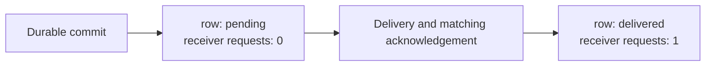
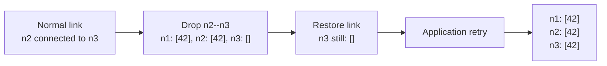
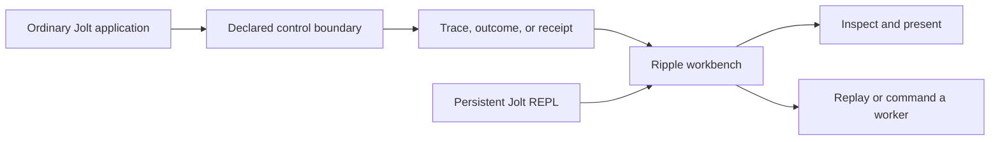

# jolt-sim

Reproduce a concurrency failure and inspect the recorded evidence. For a
supported, validated Case/Outcome, replay the exact recorded scenario, input,
and schedule in a fresh worker.

`jolt-sim` is experimental tooling for controlled execution of Jolt programs.
It can control selected schedule, time, native-effect, fault, and application
command boundaries. It records evidence for inspection. Exact replay is
available only when the document and configured worker support it.

Ripple is the shared investigation workbench. It can show saved evidence,
attach to a retained application worker, provide a persistent Jolt REPL, and
present domain values through registered views.

> [!WARNING]
> This is pre-release research code. APIs, controller ABIs, trace schemas, and
> model contracts can change without compatibility shims. This project does
> not claim that an arbitrary Jolt program is exhaustively model checked.

## See the idea in two real applications

### Stop after the durable commit

The [Outbox workbench](examples/outbox-workbench/README.md) runs the existing
HTTP, SQLite, TCP, and bencode application. It separates two operations that
are easy to confuse during a failure:

1. Accept the HTTP command and commit one durable `:pending` row.
2. Deliver that row and mark it `:delivered` after the matching acknowledgement.

The first Command Cell stops at the honest post-commit boundary. The receiver
has seen no request:



The linked evidence captures come from the
[real Playwright acceptance](viewer/test-browser-real/outbox-flow-real.spec.mjs).
That test installs no route mocks. It drives the browser, generic Command Cell
adapter, retained child, and ordinary application. The
[Outbox guide](examples/outbox-workbench/README.md) links the checked evidence
captures.

### Direct a partition, retry, and convergence

The [Broadcast workbench](examples/maelstrom-broadcast-workbench/README.md)
attaches Ripple to one retained three-node Broadcast application. A developer
can:

1. Bootstrap the cluster.
2. Drop future deliveries on the `n2`--`n3` connection.
3. Deliver one selected mailbox message at a time.
4. Observe the missing value and one dropped envelope.
5. Restore the connection. This does not replay the lost envelope.
6. Ask the existing application retry operation to run.
7. Continue until all three nodes contain the value.



The [real Broadcast Playwright acceptance](viewer/test-browser-real/broadcast-retained-real.spec.mjs)
also prepares and commits a Command Cell, rejects a stale action, steps the
same worker through the persistent REPL, and retains screenshots, video, trace,
and child-process artifacts. The
[Broadcast guide](examples/maelstrom-broadcast-workbench/README.md) links the
checked evidence captures.

## How the parts fit



The application keeps its normal HTTP, database, network, and business logic.
A scenario or adapter declares the boundary that jolt-sim may control. Ripple
does not add application behavior or a second scheduler.

### Command Cells

A Command Cell is a declared, revision-scoped operation:

- It validates an input against a closed contract.
- Its prepare step is pure and shows the exact possible successor.
- A commit publishes the selected effect once.
- A receipt projector returns bounded evidence.
- A stale branch fails without publishing another command.

This makes an application operation safe to preview before it crosses an
effect boundary. If publication is uncertain, the caller must reconcile the
recorded operation instead of sending it again.

### Workbench Items

A Workbench Item keeps immutable source EDN and a monotonic revision. Trusted
project code can register data-only presentations for a domain value. A user
can select and persist one offered presentation kind without changing the
source value. An unknown or failed presentation leaves the source available.

This is a generic data surface. The Outbox and Broadcast examples supply their
own value contracts and presenters; Ripple contains no Outbox or Broadcast
vocabulary.

### Mycelium fit

The current Command Cell is a project-local, Mycelium-shaped delegation
boundary. It has a name, input and output contracts, a pure preparation step,
an effect kind, a borrowed worker capability, and revisioned evidence.

It is not a general Mycelium runtime. The current catalogs are fixed when the
workbench starts, and the current cells describe finite command flows rather
than long-lived recursive cell evolution. The
[Mycelium gap notes](docs/research/MYCELIUM-FLOW-V1-GAPS.md) record the open
design questions. They are not a fixed architecture decision.

## Choose an entry point

| Task | Start here |
| --- | --- |
| Inspect evidence or use a persistent REPL | [Ripple guide](viewer/README.md) |
| Investigate a durable delivery boundary | [Outbox workbench](examples/outbox-workbench/README.md) |
| Direct a partition and retry story | [Broadcast workbench](examples/maelstrom-broadcast-workbench/README.md) |
| Render evidence as static HTML | [Static reports](report/README.md) |
| Find detailed contracts and test lanes | [Documentation map](docs/README.md) |
| Select the correct Jolt image and Chez version | [Prerequisites](docs/PREREQUISITES.md) |
| Review planned work | [Roadmap](docs/ROADMAP.md) |

## Execution tracks

jolt-sim has two different execution tracks. Do not treat them as the same
claim.

| Track | What it does | Claim boundary |
| --- | --- | --- |
| Cooperative model | Explores a finite, pure transition system with virtual time and canonical state. | It can support a bounded completeness claim only for the declared model and bounds. |
| Controlled ordinary runtime | Runs ordinary Jolt code through selected controller and effect hooks. | It records and replays the declared boundaries. It is not model checking of arbitrary code. |

Hegel can generate and shrink cases around a suitable boundary. It is not the
scheduler or an exhaustive state explorer.

## Current capability summary

- Cooperative scheduling, virtual time, exact traces, replay, and offline
  monitors.
- Controlled future starts, selected native effects, deterministic fault
  plans, and mixed modeled/native boundaries.
- Fresh-process case supervision with deadlines and retained artifacts.
- Deterministic native memory, SQLite, POSIX loopback, HTTP, and framed TCP
  models used by focused application fixtures.
- Static HTML reports and the loopback-only Ripple web workbench.
- Real Outbox and retained Broadcast end-to-end examples.

These are selected control surfaces, not a security sandbox. The design
assumes a program can interfere by accident. It does not yet try to contain an
adversarial program that actively escapes the declared boundaries.

## Development rule

Jolt builds and gates for this project require Chez Scheme 10.4.1. This
workspace provides a local enforcement wrapper at:

```sh
/home/chuck/ai-src/tools/jolt-with-chez-10.4.1 <command> [args...]
```

That absolute path is specific to this workspace. It is not a general install
location. See [prerequisites](docs/PREREQUISITES.md) before selecting a Jolt
image or adapting the wrapper in another checkout.

See [implementation and verification reference](docs/reference/IMPLEMENTATION-AND-VERIFICATION.md)
for the current source surfaces, security boundaries, and focused gates. The
[archived implementation snapshot](ARCHIVED-IMPLEMENTATION-SNAPSHOT.md)
preserves the former long README for historical reference. Its version pins,
paths, and “current” claims are not setup guidance.
