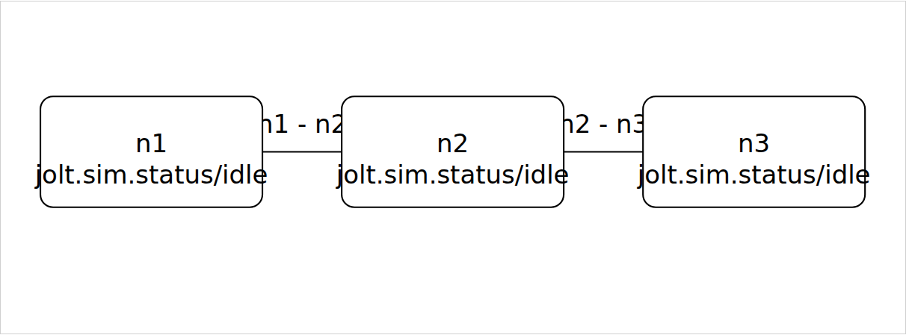

# Maelstrom Broadcast workbench

This workbench attaches Ripple and its persistent REPL to one retained
three-node Broadcast application. You can deliver one mailbox message, drop or
restore a connection, ask the application to retry, and inspect the result.

The workbench does not implement Broadcast or retry logic. The child process
owns the existing application and its in-memory transport.

```text
client -> n1 <-> n2 <-> n3
                  ^
             drop or restore
```

## Start it

Run from this directory. The parent image must support evaluation. The child
image in `JOLT_SIM_BIN` must run this checkout's Broadcast worker. Set
`JOLT_SIM_PROJECT_DIR` to the absolute path of this checkout.

```sh
cd examples/maelstrom-broadcast-workbench

JOLT_SIM_VIEWER_TOKEN='use-at-least-32-private-characters' \
JOLT_SIM_BIN='/absolute/path/to/sim-enabled-jolt' \
JOLT_SIM_PROJECT_DIR='/absolute/path/to/jolt-sim' \
JOLT_SIM_RETAINED_ARTIFACT_DIR='/absolute/path/to/writable-artifacts' \
  /absolute/path/to/eval-capable-jolt -M:workbench config/ripple.edn
```

Open the printed URL and enter the token. The token is a capability for the
persistent REPL, so keep it private. Use `JOLT_SIM_VIEWER_PORT=0` when you
need an available local port. Ctrl+C stops the viewer and asks the child to
stop cleanly.

These screenshots come from the real retained-worker browser acceptance. They
are not route mocks.




## Run the partition and heal story

1. Select **Refresh worker**, then send `{:op :inspect}` and `{:op :bootstrap}`.
2. On the `n2--n3` connection, select **Drop future deliveries**.
3. Use **Deliver next mailbox** until the ready mailboxes are empty.
4. Select **Restore deliveries**, then send `{:op :retry}`.
5. Deliver ready mailboxes until the cluster converges. Send `{:op :read}`;
   the reply contains `[42]`.
6. Send `{:op :stop}` when you are done.

The connection action changes future sends only. It does not replay an already
dropped envelope. The retry action is the application's existing
`retry-pending!` operation.

## Use the shared REPL

The retained panel and the REPL use one serialized child. A command from one
surface changes the coordinate seen by the other. These helpers are available
after launch:

```clojure
(require '[maelstrom-broadcast-workbench.main :as wb] :reload)

(wb/inspect!)
(wb/bootstrap!)
(wb/drop-connection! ["n2" "n3"] 0)
(wb/step! "n1")
(wb/restore-connection! ["n2" "n3"] 1)
(wb/retry!)
(wb/read!)
(wb/stop-worker!)
```

Connection changes are revision-scoped. Refresh before you use a displayed
action. A stale action fails instead of changing the connection.

## Limits and verification

This is the real Broadcast application over its deterministic in-memory
transport. It is not the official Maelstrom JSON-lines process, an OS network
test, automatic schedule exploration, or a second retry engine.

Use `:workbench-test` for the focused loopback gate. The real browser
acceptance is under `viewer/test-browser-real` and uses
`playwright.broadcast-retained.config.mjs`. Read the
[detailed workbench notes](../../docs/research/BROADCAST-WORKBENCH-DETAILS.md)
for exact commands, cleanup behavior, artifacts, and boundaries.
