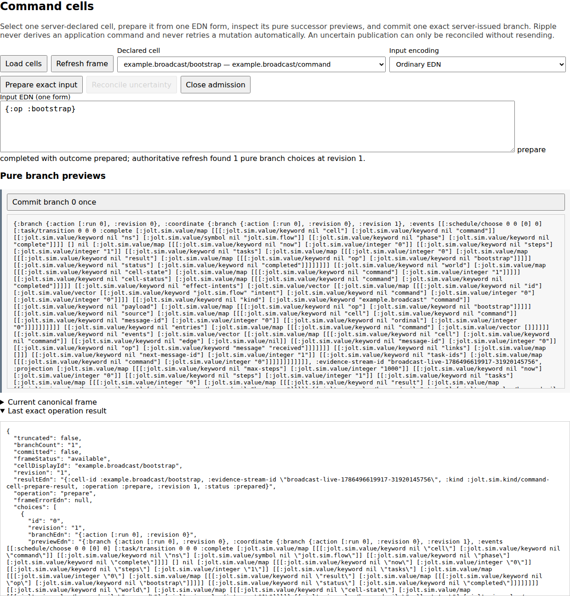
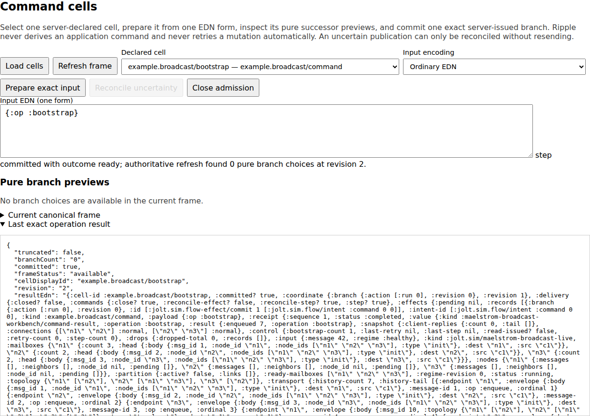

# Maelstrom Broadcast workbench

Use this workbench to direct a small distributed-system failure story. Ripple
and its persistent REPL attach to one retained three-node Broadcast
application. You can deliver one mailbox message, change one connection,
invoke the application's retry, and inspect the result.

The child uses the existing Broadcast handlers and deterministic in-memory
transport. The workbench does not implement Broadcast, retry, or message
delivery logic.

```text
client -> n1 <-> n2 <-> n3
                  ^
             drop or restore
```

## Start it

Read [prerequisites](../../docs/PREREQUISITES.md) before selecting the two Jolt
images or adapting the workspace-local Chez wrapper path.

The parent image must support persistent evaluation. The child selected by
`JOLT_SIM_BIN` must run this checkout's retained Broadcast worker.

```sh
cd examples/maelstrom-broadcast-workbench

JOLT_SIM_VIEWER_TOKEN='use-at-least-32-private-characters' \
JOLT_SIM_BIN='/absolute/path/to/jolt-capable-of-running-the-worker' \
JOLT_SIM_PROJECT_DIR='/absolute/path/to/jolt-sim' \
JOLT_SIM_RETAINED_ARTIFACT_DIR='/absolute/path/to/writable-artifacts' \
  /home/chuck/ai-src/tools/jolt-with-chez-10.4.1 \
  /absolute/path/to/eval-capable-jolt \
  -M:workbench config/ripple.edn
```

Open the printed loopback URL and enter the token. Keep the token private; it
grants access to the persistent REPL. Set `JOLT_SIM_VIEWER_PORT=0` when you
need an available port. Ctrl+C asks the child to stop and uses the bounded reap
path only if it does not exit.

## Direct the partition and retry story

1. Choose **Refresh worker** and send `{:op :inspect}`.
2. Select the `example.broadcast/bootstrap` Command Cell.
3. Enter `{:op :bootstrap}` and choose **Prepare exact input**.
4. Inspect the pure successor, then choose **Commit branch 0 once**.
5. Refresh the application snapshot.
6. On the `n2--n3` edge, choose **Drop future deliveries**.
7. Use **Deliver next mailbox** until no mailbox is ready.
8. Inspect the partition: `n1` and `n2` contain `42`; `n3` does not.
9. Choose **Restore deliveries**. No mailbox becomes ready yet.
10. Send `{:op :retry}`, then continue mailbox delivery.
11. Send `{:op :read}` and deliver the read to `n3`. The reply contains `[42]`.
12. Send `{:op :stop}`.

Restoring the connection changes future delivery policy. It does not replay
the dropped envelope. Retry uses the unchanged application's existing pending
identity.

These screenshots come from the real no-mock browser acceptance:

[](docs/ripple-broadcast-topology.png)

[](docs/ripple-broadcast-edge-actions.png)

The [capture manifest](../../docs/CAPTURE-MANIFEST.md) maps these curated images
to the generated Playwright artifacts and records the missing storyboard
frames.

## Preview a command before publication

The generic Command Cell surface makes the effect boundary visible. Catalog
reads and preparation do not consume the retained worker's next sequence.

[](docs/ripple-broadcast-command-cell-prepared.png)

Commit publishes the server-issued branch once. The result below comes from
the real retained child after it accepted Bootstrap:

[](docs/ripple-broadcast-command-cell-running.png)

The project supplies eight closed operation contracts, their pure compilers,
and receipt projectors. Ripple supplies the catalog, preparation, commit,
evidence, and browser protocol. A stale revision or session epoch fails without
publishing another worker command.

## Use the shared REPL

The REPL and retained panel address the same serialized child. A command from
one surface changes the coordinate observed by the other.

```clojure
(require '[maelstrom-broadcast-workbench.main :as wb] :reload)

(wb/inspect!)
(wb/bootstrap!)
(wb/step! "n2")
(wb/set-connection-regime! ["n2" "n3"] 0 :drop)
(wb/set-connection-regime! ["n2" "n3"] 1 :normal)
(wb/retry!)
(wb/read!)
(wb/stop-worker!)
```

Connection actions carry the current application revision. Refresh before you
use a displayed action. Reusing an old action produces a definite application
failure and does not change connection state.

The same worker can be commanded through a project-local Command Cell:

```clojure
(require '[jolt.sim.flow-effect-session :as effect] :reload)

(def cell (wb/command-session {:op :inspect}))
(def branch (:branch (first (effect/branches cell))))
(effect/step! cell branch)
```

Creating the cell and reading its branch is pure. Committing the branch
authorizes one retained command. If publication is uncertain, reconcile the
recorded sequence instead of sending the operation again.

## Presentation model

The Broadcast project maps its snapshot to Ripple's generic bounded topology
kind. The model contains nodes, edges, fields, statuses, and inert canonical
action descriptors. Ripple contains no Broadcast-specific vocabulary.

The presenter is pure. Static reports can display its action descriptors but
cannot execute them. A live Ripple session can invoke only the current action
installed by trusted project code.

## Verification and limits

The [real Playwright acceptance](../../viewer/test-browser-real/broadcast-retained-real.spec.mjs)
installs no route mocks. It drives the retained worker through Ripple and the
shared REPL, checks stale-action rejection, runs retry to convergence, and
retains trace, video, screenshots, and child artifacts. Its configuration is
`viewer/playwright.broadcast-retained.config.mjs`; outputs are under
`viewer/target/ripple-playwright/broadcast-retained`.

Focused aliases are `:presentation-test`, `:flow-contract-test`,
`:workbench-test`, and `:flow-effect-test`.

This is the real Broadcast application over its deterministic in-memory
transport. It is not the official Maelstrom JSON-lines process, an OS network
test, automatic schedule exploration, rewind, or a second retry engine.

See [implementation and verification](../../docs/reference/IMPLEMENTATION-AND-VERIFICATION.md)
for exact evidence, process, and security boundaries. See the
[archived Broadcast README snapshot](ARCHIVED-README-SNAPSHOT.md) only for
historical detail; its machine paths and “current” claims can be stale.
