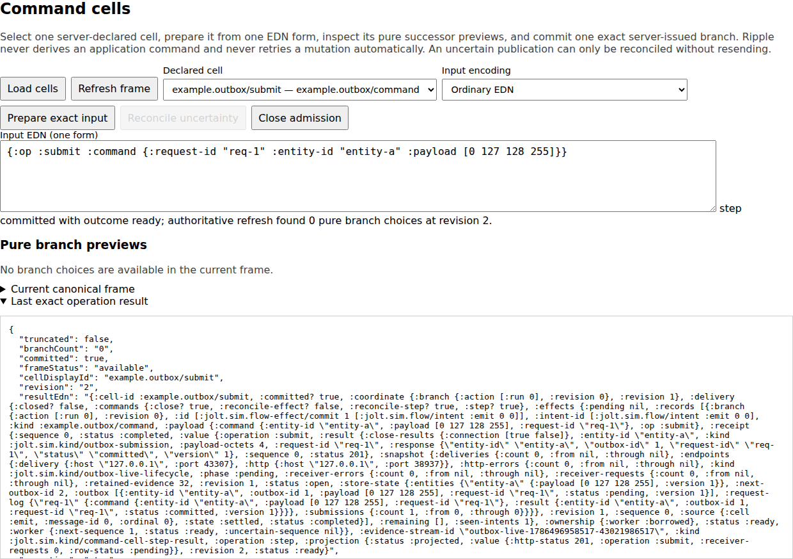
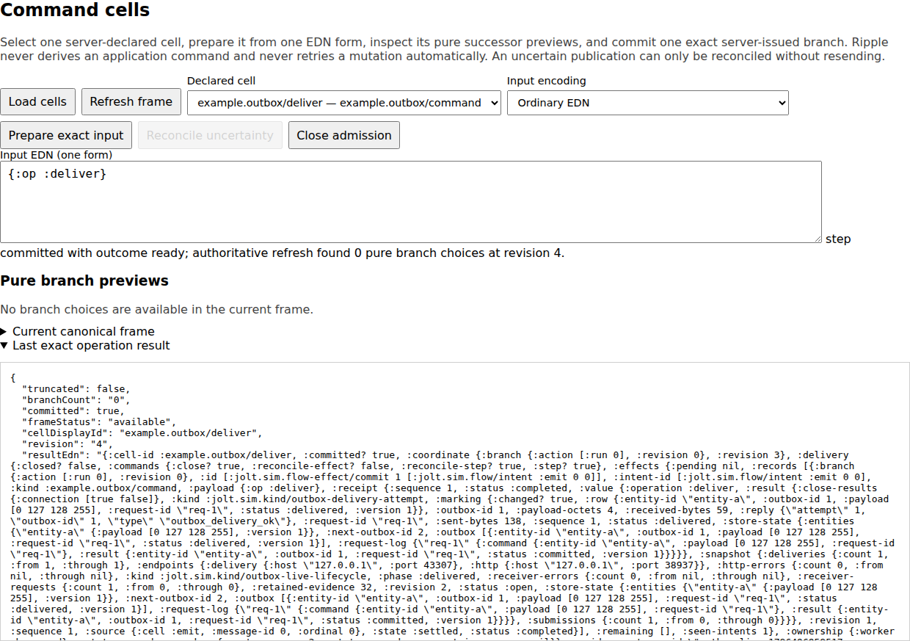

# Outbox workbench

Use this workbench to investigate one real durable-delivery boundary:

1. The HTTP command commits an Outbox row to SQLite.
2. The row is `:pending`. The receiver has seen no request.
3. A separate operation sends the row through TCP/bencode.
4. A matching acknowledgement permits the durable `:delivered` mark.

The workbench runs the existing Outbox application. It does not replace the
HTTP, database, network, codec, or acknowledgement rules.

```text
JSON command -> HTTP -> SQLite outbox -> TCP/bencode receiver -> acknowledgement
                            |                                    |
                            +-------- pending -> delivered -------+
```

## Watch the boundary in Ripple

The retained flow installs two generic Command Cells. Select
`example.outbox/submit`, prepare the exact command, and commit its only branch.
The child returns HTTP 201 and one durable pending row. Preparation itself does
not publish a child command.

[](docs/ripple-outbox-command-cell-pending.png)

Next select `example.outbox/deliver`, prepare `{:op :deliver}`, and commit. The
same row becomes delivered only after the correlated acknowledgement. The
receiver request count changes from zero to one.

[](docs/ripple-outbox-command-cell-delivered.png)

These screenshots come from the
[real no-mock Playwright acceptance](../../viewer/test-browser-real/outbox-flow-real.spec.mjs).
It also checks that the generic Workbench contains the three updatable Command
Cell evidence items: prepare, commit, and projected receipt.
The [capture manifest](../../docs/CAPTURE-MANIFEST.md) records their generated
artifact names and current readability limits.

## Start the retained flow

Read [prerequisites](../../docs/PREREQUISITES.md) before selecting the two Jolt
images or adapting the workspace-local Chez wrapper path.

The parent image must support persistent evaluation. `JOLT_SIM_BIN` selects the
child that runs this checkout. `JOLT_SIM_PROJECT_DIR` is the absolute path of
the same checkout.

```sh
cd examples/outbox-workbench

JOLT_SIM_VIEWER_TOKEN='use-at-least-32-private-characters' \
JOLT_SIM_BIN='/absolute/path/to/sim-enabled-jolt' \
JOLT_SIM_PROJECT_DIR='/absolute/path/to/jolt-sim' \
  /home/chuck/ai-src/tools/jolt-with-chez-10.4.1 \
  /absolute/path/to/eval-capable-jolt -M:flow-ripple
```

Open the printed loopback URL and enter the token. Keep the token private; the
workbench includes a persistent REPL and the token grants code execution in the
parent process.

The flow surface exposes one submit branch at revision 0 and one delivery
branch at revision 1. Ripple and the REPL address the same revision-scoped
session and retained worker.

## Start the simple REPL workbench

Use the eval-only mode when you want one complete real run instead of the
post-commit pause:

```sh
cd examples/outbox-workbench
JOLT_SIM_VIEWER_TOKEN='use-at-least-32-private-characters' \
  /home/chuck/ai-src/tools/jolt-with-chez-10.4.1 \
  /absolute/path/to/eval-capable-jolt -M:workbench
```

Run these forms in the Ripple REPL:

```clojure
(require 'jolt.sim.fixtures.outbox-json-delivery)

(def run
  (jolt.sim.fixtures.outbox-json-delivery/exercise-outbox-json-delivery))

[(get-in run [:http :status])
 (get-in run [:application :store-state :outbox 0 :status])
 (get-in run [:application :delivery :replies 0 "type"])]
```

The result is:

```clojure
[201 :delivered "outbox_delivery_ok"]
```

This mode runs the whole application in one evaluation. It does not stop after
the commit or create the live Command Cell evidence items.

## Use the lifecycle from a REPL

The UI-neutral lifecycle exposes the same honest pause boundary:

```clojure
(require '[jolt.sim.fixtures.outbox-json-delivery-live :as live]
         '[jolt.sim.fixtures.outbox-json-delivery :as fixture])

(def app (live/start!))
(live/submit-command! app fixture/default-command) ; row is :pending
(live/snapshot! app)
(live/deliver-next! app)                           ; row is :delivered
(live/snapshot! app)
(live/stop! app)
```

A mismatched acknowledgement fails before the delivered mark and leaves the
row pending.

## Other modes

| Mode | Alias | Use it for |
| --- | --- | --- |
| Retained worker | `-M:retained-workbench` | Explicit inspect, submit, deliver, reconcile, and stop commands in a separate child. |
| Revisioned flow | `-M:flow-ripple` | Shared Ripple and REPL control of submit and delivery. |
| Eval-only | `-M:workbench` | One-shot application forms in the persistent REPL. |

The retained command form is:

```clojure
{:op :submit
 :command {:request-id "req-1"
           :entity-id "entity-a"
           :payload [0 127 128 255]}}
```

Then use `{:op :deliver}`, `{:op :inspect}`, and `{:op :stop}`. If command
publication is uncertain, reconcile the recorded sequence. Do not assume that
it is safe to send the command again.

## Verification and limits

The real browser lane uses
`viewer/playwright.outbox-flow.config.mjs` and retains its outputs under
`viewer/target/ripple-playwright/outbox-flow`. Focused aliases include
`:eval-flow-test`, `:live-lifecycle-test`, `:retained-workbench-test`,
`:flow-contract-test`, `:flow-retained-test`, and `:flow-ripple-test`.

This example uses real loopback HTTP, SQLite, TCP, and bencode. It does not
pause an arbitrary native call or transaction, explore schedules, rewind the
process, or prove exactly-once delivery.

See [implementation and verification](../../docs/reference/IMPLEMENTATION-AND-VERIFICATION.md)
for the process, evidence, and security boundaries. See the
[archived Outbox README snapshot](ARCHIVED-README-SNAPSHOT.md) only for
historical detail; its machine paths and Jolt version note can be stale.
