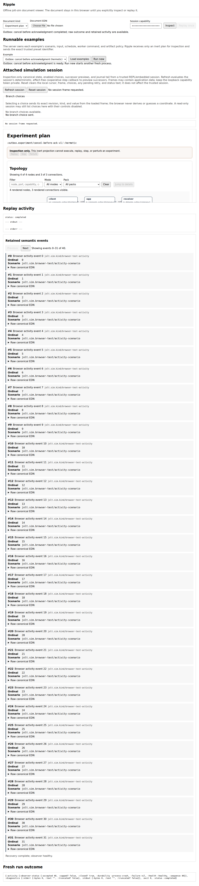
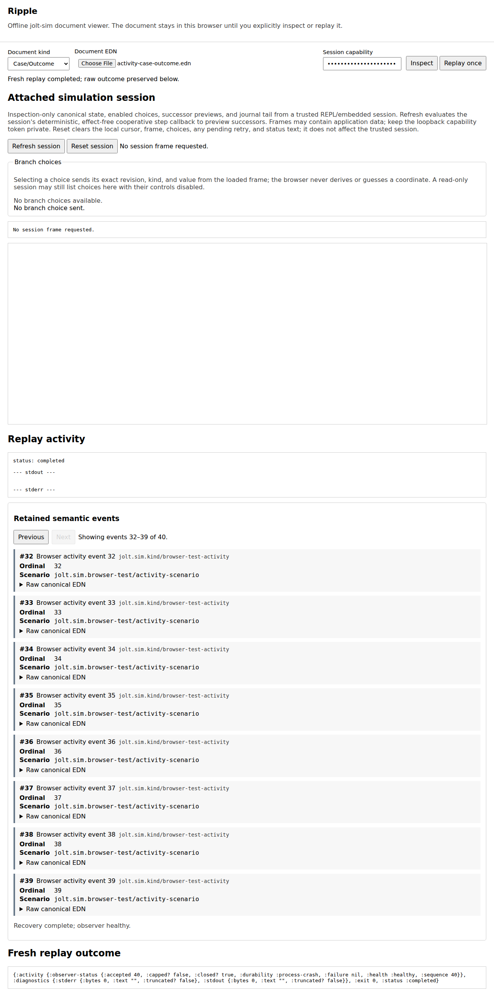

# Ripple

Ripple is the offline jolt-sim document viewer. This optional dependency root
serves a small loopback-only web UI over the existing trace and Case/Outcome
reporters, a safe experiment-plan inspector, and the fresh-process replay
helper. It does not implement another
scheduler, controller, monitor, evidence schema, or worker protocol.

The browser keeps the selected EDN file locally until **Inspect** or **Replay
once** is pressed. Every request requires a startup capability token. The
upload UI requires an explicit document kind -- **Trace**, **Case/Outcome**,
or **Experiment plan** -- and the server never infers or guesses a schema from
the uploaded bytes.
Trace documents render through `jolt.sim.report/trace->html` and are never
replayable; experiment-plan documents render only their safe projection and
are also never replayable. Case/Outcome documents render through
`jolt.sim.report/case-outcome->html` and keep the existing replay path. Replay
uses only the scenario, input, and schedule restored from the validated
Case/Outcome document; worker command, working directory, deadlines,
environment, and artifact policy come from the trusted server configuration.
Scenarios must be explicitly allowlisted.

Experiment plans are inspection-only. The process-local map returned by
`jolt.sim.experiment/plan-data` still contains executable handler functions,
probes, projectors, monitors, presenters, and possibly sensitive pack
configuration. It must never be persisted or uploaded. First convert it to
the closed inert viewer document:

```clojure
(require '[jolt.sim.experiment :as experiment]
         '[jolt.sim.viewer.experiment :as viewer-experiment])

(spit "experiment-plan.edn"
      (viewer-experiment/canonical-edn
       (viewer-experiment/plan-data->document
        (experiment/plan-data compiled-plan))))
```

That projection retains only experiment/profile identity, node and port
capabilities, connection endpoints/pack/mode, handler pack ownership and
counts, check identities, runtime FFI mode, and monitor/presentation counts.
It cannot replay, step, perturb, resolve code, or reconstruct an executable
plan. [`examples/experiment-plan.edn`](examples/experiment-plan.edn) is an
inert representative fixture that can be opened in Ripple without compiling a
live plan.

Programmatic and REPL-driven startup may also include a trusted
`:presentation-registry` map. Ripple composes it after jolt-sim's built-in
event presenters, so application entries override library/default displays
without changing the trace or the simulator. This value contains functions
and therefore belongs in ordinary Clojure startup code, not the EDN config
file. Uploaded documents can only select already-registered event-tag,
transition-operation, or canonical transition-site entries; they cannot load
or name presenter code. Presenter implementations must nevertheless treat the
validated event passed to them as untrusted input: they must not evaluate it,
use it to select filesystem paths or native calls, or perform other
input-directed side effects. See the report README for the small presenter
shape.

The server admits one body-consuming inspection or replay request at a time,
even when several tabs share the capability. A competing request receives 429
before its body is read. Two bounded HTTP threads let jolt-http's parser keep
feeding that one request while its handler consumes a segmented body; this
does not permit a second replay process.

Copy [`example-config.edn`](example-config.edn), replace the absolute paths,
and start the viewer with the sim-enabled Jolt image:

```sh
cd viewer
JOLT_SIM_VIEWER_TOKEN='replace-with-at-least-32-random-characters' \
  /absolute/path/to/sim/jolt -M:viewer /absolute/path/to/viewer-config.edn
```

Port `0` selects an ephemeral loopback port and the startup message prints the
actual URL. A fixed port such as `8788` is more convenient for repeated use.
Press Ctrl+C in the foreground viewer process to stop the listener and handler
pool cleanly; the command-line entry point owns SIGINT and runs server shutdown
before exiting.

The Linux CI gate exercises that real signal path in a fresh process and
retains the config, stdout, and stderr for every run:

```sh
JOLT_SIM_BIN=/absolute/path/to/sim/jolt \
JOLT_SIM_PROJECT_DIR=/absolute/path/to/jolt-sim \
  test/cli-sigint-smoke.sh
```

The configuration is deliberately closed. Ambient replay keys are limited to
the public process-explorer settings; browser data cannot replace them. The
example retains completed worker directories as well as failures because the
viewer is an investigation tool. `:temp-dir` is the existing parent under
which the process explorer creates one isolated run directory; it is not an
output directory chosen by the uploaded document.

Current boundary: inspection is a real report render (trace documents through
the trace report, Case/Outcome documents through the Case/Outcome report, and
safe experiment-plan projections through specialized presentation kinds), and
replay delegates to one real fresh worker for Case/Outcome documents only.
Hosted CI drives the checked-in canonical outbox Case/Outcome through the live
viewer HTTP API, executes its unchanged HTTP/SQLite/TCP/bencode scenario in
that worker, and retains the complete worker directory plus an append-only
phase log. Ripple also exposes the trusted runnable examples described
below. The UI does not yet compare two outcomes, evaluate post-hoc invariants,
or expose a general application-defined scenario catalog. Those are later
viewer slices over the same evidence and execution APIs.

### Run a trusted example

Ripple can start a canonical example without first uploading a retained
Case/Outcome. **Load examples** fetches the server's closed preset catalog,
and **Run new** starts the selected preset in one fresh worker. The first
executable preset is **Outbox: cancel before acknowledgment**:
the ordinary compiled HTTP -> SQLite -> TCP/bencode outbox application under
the truthful `:hermetic` profile. The application and its library adapters run
unchanged; Ripple does not reimplement their HTTP, database, networking, codec,
or cancellation behavior.

The second executable preset is **Maelstrom Echo: init and echo round trip**:
the existing ordinary `jolt.maelstrom.fixtures.echo-scenario/echo-roundtrip`
defsim scenario under the same truthful `:hermetic` profile. One fresh worker
runs the unchanged `jolt.maelstrom.node` boundary, `jolt.maelstrom.echo`
handler, and `jolt.maelstrom.transport.memory` endpoints over one exact
nested Unicode echo input; Ripple does not reimplement node, Echo, or
transport behavior. Its inert plan projection is the checked-in two-endpoint
topology [`examples/maelstrom-echo-plan.edn`](examples/maelstrom-echo-plan.edn):
a client and a node joined by the simulated request and reply connections,
with zero FFI handler packs. The preset carries no schedule, so the run
drives no `:future-schedule` override, and it reuses the same trusted fresh
worker command as the outbox preset -- that existing worker alias already
resolves the scenario from this repository's own source and test roots.

The browser is not an execution-coordinate editor. A trusted startup preset
owns its allowlisted scenario symbol, canonical input, exact optional
schedule, and runtime profile. `GET /api/run-presets` publishes only its ID,
label, profile ID, and validated inert experiment-plan EDN. `POST /api/run`
accepts only the selected preset ID. Scenario, input, schedule, worker command,
working directory, deadlines, environment, and artifact policy therefore
remain server-owned and cannot be replaced by browser data. Run and replay
share the same single-flight admission, progress model, path redaction,
retained activity, and outcome handling.

For these presets, start Ripple programmatically from a project REPL or a
small launcher namespace so the trusted configuration can read the checked-in
plans without duplicating them in the command-line EDN file:

```clojure
(require '[jolt.sim.viewer :as viewer]
         '[jolt.sim.viewer.experiment :as viewer-experiment])

(def ripple
  (viewer/start!
   {:port 8788
    :capability-token (System/getenv "JOLT_SIM_VIEWER_TOKEN")
    :max-document-bytes 1048576
    :allowed-scenarios
    #{'jolt.sim.fixtures.outbox-experiment-scenarios/exercise-cancel-before-ack-compiled
      'jolt.maelstrom.fixtures.echo-scenario/echo-roundtrip}
    :run-presets
    [{:id :jolt.sim.preset/outbox-cancel-before-ack-v1
      :label "Outbox: cancel before acknowledgment"
      :scenario
      'jolt.sim.fixtures.outbox-experiment-scenarios/exercise-cancel-before-ack-compiled
      :profile-id :hermetic
      :input {:payload [0 127 128 255]
              :stream-capacity 8
              :pipe-capacity 1
              :poll-eintr-ordinal nil}
      :schedule nil
      :plan-document
      (viewer-experiment/read-edn
       (slurp "examples/outbox-cancel-before-ack-plan.edn"))}
     {:id :jolt.sim.preset/maelstrom-echo-roundtrip-v1
      :label "Maelstrom Echo: init and echo round trip"
      :scenario 'jolt.maelstrom.fixtures.echo-scenario/echo-roundtrip
      :profile-id :hermetic
      :input {"greeting" "héllo, 世界 🌍"
              "lang" "日本語"
              "nested" {"a" "ελληνικά"
                       "b" [" 한글 " "português" 42 nil]}
              "emoji" "🚀"}
      :schedule nil
      :plan-document
      (viewer-experiment/read-edn
       (slurp "examples/maelstrom-echo-plan.edn"))}]
    :runtime-config
    {:worker-command [(System/getenv "JOLT_SIM_BIN")
                      "-M:outbox-delivery-explore-worker"]
     :dir "/absolute/path/to/jolt-sim"
     :timeout-ms 60000
     :startup-timeout-ms 120000
     :kill-grace-ms 500
     :temp-dir "/absolute/path/to/retained-runs"
     :retain-completed-artifacts? true
     :activity-journal? true}}))
```

Run that form with the process working directory set to `viewer`, an absolute
`JOLT_SIM_BIN`, a writable retained-run parent, and a capability token of at
least 32 characters. The `-M:viewer` command-line path remains available: put
the same closed maps in the EDN configuration and inline the contents of
[`examples/outbox-cancel-before-ack-plan.edn`](examples/outbox-cancel-before-ack-plan.edn)
and [`examples/maelstrom-echo-plan.edn`](examples/maelstrom-echo-plan.edn)
as `:plan-document`.

The UI renders the selected preset's topology before execution -- four nodes
and three connections for the outbox, the two endpoints and two simulated
connections for Maelstrom Echo -- then uses the existing progress, retained
semantic activity, and terminal outcome views for the run:

[](docs/ripple-run-new-outbox.png)

Each fresh run is an interactive application witness, **not** the existing
two-worker real/hermetic parity proof. Browser-selectable regimes,
parameterized inputs, and a second independently truthful execution profile
remain later slices; the UI will not advertise choices that the worker cannot
yet enforce.

### Replay activity panel

While a replay runs, the page polls the authenticated `GET
/api/replay-progress` endpoint and renders a small "Replay activity" panel
below the report. This is an ephemeral progress view over the *same* single
fresh-process replay started by **Replay once** -- it is not a second replay
implementation, a scheduler, or an evidence store.

The endpoint never accepts a filesystem path (or any other input) from the
browser. It reports the one server-owned active/most-recent replay by reading
only fixed basenames from the trusted run directory that
`jolt.sim.process-explorer` already creates for that replay: `worker-ready.edn`
and -- existence only, never parsed -- `result.edn` as milestones, and up to
65536 bytes each of `stdout.log`/`stderr.log`. Active responses expose the
last milestone as the boolean `result-observed?`, allowing a client or test to
distinguish a genuinely in-flight worker from a child that has already written
its result while the supervising POST is still unwinding. A file may be
missing or partially written at any moment; both are tolerated. The response is JSON
(`Content-Type: application/json`) with `Cache-Control: no-store`, exactly
like every other viewer response, and requires the same capability token and
loopback binding as `/api/render` and `/api/replay`.

The reported `status` is one of a small closed set: `idle` (no replay has
run), `starting` (accepted; the worker is not yet confirmed alive),
`worker-ready` (the worker's readiness marker exists), `running` (readiness
and/or output is observable), `completed`, or `failed`. The terminal snapshot
reuses the exact bounded stdout/stderr diagnostics process-explorer already
captured before its own artifact cleanup ran, so it renders correctly even
when `:retain-completed-artifacts?` is false and the run directory has since
been removed. The browser renders every dynamic string through `textContent`
only and polls at most one request at a time. Polling continues until the
authoritative replay POST settles, then performs one final snapshot fetch.
Non-final polls render only active statuses, so the previous replay's idle or
terminal snapshot cannot replace the new replay's local `starting` state even
if a fresh progress GET reaches the server before its replay POST. A generation
token discards older in-flight poll responses, and the file, capability,
inspect, and replay controls remain disabled for the complete request so a
second click cannot stop observation of the first replay.

The E2E gate uses an optional trusted observer in the ordinary outbox fixture.
That observer writes a retained checkpoint only after the real HTTP command
has committed to SQLite and the pending row has been reloaded and validated,
but before delivery attempt 1. The parent then samples the authenticated
endpoint, requires `result-observed?` to be false, writes a retained release
record, and requires the same worker's normal Case/Outcome completion. The
default fixture and scenario path supply no observer and remain unchanged; the
viewer does not reimplement HTTP, SQLite, TCP, bencode, or application logic.

When trusted startup configuration also enables `:activity-journal?` and
completed-artifact retention, the terminal progress response pages the same
append-only semantic activity retained by the process supervisor. Ripple
renders at most 32 events per explicit page with their sequence, registered
kind, summary, EDN-valued fields, and complete canonical event EDN. **Next** and
**Previous** use the server-issued cursor; the browser validates the requested
cursor, response body, and continuation header together and discards a delayed
page after a new document or replay resets the generation. A presentation that
exceeds the response bound can be skipped using its advancing continuation
without changing the authoritative replay outcome.

The semantic page comes from the public immutable `jolt.sim.activity-view`
model. The HTTP handler and browser are consumers: a REPL, `datafy`/`nav`,
`tap>`, static report, Glimmer client, or other UI can use the same page and
application-owned kind registry without extracting logic from Ripple. The
server retains `:artifact-dir` only as its private read coordinate; neither the
replay response nor activity JSON discloses the host path.

[](docs/ripple-retained-activity.png)

The Playwright acceptance gate uploads a checked-in Case/Outcome through the
real handler, writes a real 40-record journal, proves pages `0..31` and
`32..39` in both directions without gaps or duplicates, rejects a mismatched
coordinate, follows an oversized-page continuation, suppresses a delayed stale
response, and checks every API exchange and the DOM for private path leakage:

```sh
cd viewer
JOLT_SIM_BIN=/absolute/path/to/sim/jolt npm ci
npx playwright install chromium
npm run test:browser
```

Successful screenshots and failure-only trace/video/screenshots are written
under `target/ripple-playwright`; hosted CI uploads that directory even when a
later application or Hegel gate fails.

### In-process session stepping adapter

`jolt.sim.session-view` is a UI-neutral, in-process adapter over one
`jolt.sim.session` Session (the cooperative REPL control capability). It is
not HTTP, a UI, a remote protocol, another scheduler, durable storage, or a
generic effect layer: every branch preview and transition delegates to the
Session, and the adapter owns only the bounded optimistic retry budget that
keeps one read coherent.

`read-frame` returns one coherent, closed frame: the snapshot, the isolated
branch previews, and the append-only journal tail from a validated integer
cursor, all at the same session revision. A concurrent REPL step cannot mix
revisions -- the read retries (bounded) until two consecutive snapshot reads
agree and fails closed with a typed `::coherence-failed` error otherwise. A
malformed or out-of-range cursor fails closed with `::invalid-cursor`.
The returned `:journal/:next-cursor` can be passed to the next read to receive
only entries appended afterward.

`step-frame!` synchronously applies one exact revision-scoped branch and
returns an explicit command-result envelope. A committed result always carries
its plain branch/revision acknowledgment, even if the post-commit frame cannot
be obtained; this prevents an ambiguous retry from executing a command twice.
A stale branch is never silently rebased just because the same action identity
remains enabled: shared state may have changed since the displayed preview.
Instead, the result is `:stale`, carries a refreshed frame, and requires the
human or agent to choose again explicitly.
