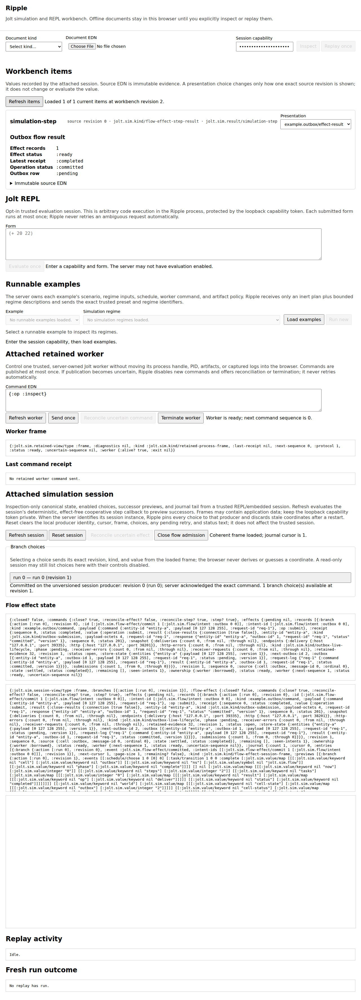

# Ripple

Ripple is a generic loopback workbench for jolt-sim investigations. Start with
a saved document, attach a retained application worker, or enable a persistent
Jolt REPL. As the investigation grows, all three surfaces can share one
session.

Ripple does not implement the application, scheduler, fault model, or evidence
format. A trusted launcher supplies those capabilities.

[](docs/ripple-persistent-eval-session.png)

[](docs/ripple-workbench-items-outbox.png)

## What you can do

| Surface | Use it for | Limit |
| --- | --- | --- |
| Document inspector | Open a trace, Case/Outcome, experiment plan, or official Maelstrom run. | Select the document kind. Ripple does not guess it. |
| Exact replay | Run the scenario, input, and schedule from one validated Case/Outcome. | Not available for traces, experiment plans, or official-run documents. |
| Run preset | Start a scenario from a catalog installed by the launcher. | Browser input cannot add a scenario or replace worker settings. |
| Persistent REPL | Evaluate one form at a time in a retained Jolt namespace. | The capability token grants code execution when this is enabled. |
| Retained worker | Inspect, command, reconcile, or stop an attached process. | The application owns its command set and lifecycle. |
| Command Cells | Validate and preview a declared operation, then commit one exact branch. | A stale revision or session epoch fails before publication. |
| Workbench Items | Inspect source EDN and choose a registered data presentation. | Only trusted presentation kinds already offered for the item can run. |

## Start the document viewer

First select the correct image and compiler environment. See
[prerequisites](../docs/PREREQUISITES.md). An image that can inspect documents
is not necessarily able to evaluate forms or run a simulation worker.

Copy the example configuration and replace its absolute paths. The trusted
configuration owns the worker command, project directory, deadlines,
environment, artifact policy, scenario allowlist, and run presets.

```sh
cd viewer
cp example-config.edn viewer-config.edn
# Edit viewer-config.edn before you continue.

JOLT_SIM_VIEWER_TOKEN='use-at-least-32-private-characters' \
  /absolute/path/to/sim-enabled-jolt -M:viewer viewer-config.edn
```

Open the URL printed by the process. Use `:port 0` in the configuration when
you need an available loopback port. Press Ctrl+C in the foreground process to
stop Ripple.

To add the REPL pane, use the same command with `--eval`:

```sh
JOLT_SIM_VIEWER_TOKEN='use-at-least-32-private-characters' \
  /absolute/path/to/eval-capable-jolt -M:viewer --eval viewer-config.edn
```

Ripple listens on loopback only, but the token is still a capability. With
`--eval`, it grants code execution in the Ripple process. Do not put it in a
configuration file or share it.

## Choose a launch mode

The viewer, replay worker, REPL, and application worker are separate
capabilities. A launcher can compose only the parts a project needs.

| Need | Configuration |
| --- | --- |
| Inspect documents | Omit `:allowed-scenarios` and `:runtime-config`. |
| Inspect and replay | Supply both keys. The checked-in example does this. |
| Inspect and evaluate forms | Start with `--eval`; the replay pair is optional. |
| Attach an application worker | Use a project launcher such as an example workbench. |
| Add Command Cells or presentations | Install a trusted catalog when the project starts Ripple. |

An experiment plan is always inspection-only. Convert a live plan to its
closed viewer document before upload. A live plan can contain functions or
sensitive configuration.

## Investigate with Command Cells

A Command Cell turns a project operation into a declared interaction:

1. Select a cell from the project catalog.
2. Enter an input that matches its closed schema.
3. Choose **Prepare exact input**.
4. Inspect the pure successor and its revision-scoped branch.
5. Choose the branch once to publish the effect.
6. Inspect the projected receipt and retained evidence.

Preparation does not command the attached worker. Commit publishes only the
server-issued branch for the current session and revision. If the result is
uncertain, use reconciliation; do not repeat the command by assumption.

The UI, session protocol, evidence item shape, and browser adapter are generic.
The project supplies the input contract, pure compiler, effect capability, and
receipt projector.

The [Outbox workbench](../examples/outbox-workbench/README.md) uses two cells
to separate durable commit from delivery. The
[Broadcast workbench](../examples/maelstrom-broadcast-workbench/README.md) uses
the same surface for bootstrap, mailbox steps, connection changes, retry,
read, inspect, and stop.

## Inspect and present Workbench Items

A WorkbenchSession collects immutable results from the services attached to
the investigation. Each item keeps:

- a stable item identifier;
- canonical source EDN;
- a monotonic revision;
- the selected registered presentation kind, if any;
- bounded data-only presentation output.

Ripple automatically records evaluation, simulation, and Command Cell results
that are meant for this presentation surface. It does not copy every raw
retained command or reconciliation result into Workbench Items. The retained
worker already owns an exact append-only command and receipt journal, and
copying each growing receipt would duplicate evidence and slow long sessions.
Worker termination is still recorded as a Workbench Item because a forced stop
may not produce a child receipt.

Project code can register a function that maps a domain item to a known kind,
such as a topology, timeline, table, or field summary. The user may choose and
persist another offered kind for the current revision. This changes rendering,
not evidence.

Presentation functions are trusted launcher code. They do not enter browser
requests, configuration EDN, or saved evidence. An unknown kind, failed
presentation, or stale override leaves the canonical source value available.
The same WorkbenchSession frame can be consumed by the web UI, a REPL, or a
future native client.

## Retained workers and uncertainty

The attached worker panel addresses one process-owned command stream. Refresh
first to get the stable coordinate. Each accepted command consumes the next
sequence and produces a durable receipt. A definite application failure and an
uncertain transport result are different states.

Use **Reconcile** to ask whether an uncertain sequence completed. Use
**Terminate worker** only for the bounded forced-reap path. Normal application
shutdown should use the application's explicit stop operation when it has one.

The child artifact directory retains commands, receipts, stdout, stderr, and
terminal evidence. EvalSession history and `tap>` observations are bounded
process memory, not a durable journal.

## Real browser stories

The default browser suite uses controlled HTTP fixtures. Two dedicated
Playwright lanes install no route mocks:

- [`outbox-flow-real.spec.mjs`](test-browser-real/outbox-flow-real.spec.mjs)
  commits a real HTTP command to SQLite, verifies the pending boundary, then
  performs real TCP/bencode delivery through a second Command Cell.
- [`broadcast-retained-real.spec.mjs`](test-browser-real/broadcast-retained-real.spec.mjs)
  partitions a three-node retained application, steps the same child through
  both Ripple and its REPL, runs the application retry, and verifies
  convergence.

Their project guides contain the exact launch and verification commands:

- [Outbox workbench](../examples/outbox-workbench/README.md)
- [Broadcast workbench](../examples/maelstrom-broadcast-workbench/README.md)

The [capture manifest](../docs/CAPTURE-MANIFEST.md) maps the checked images to
the exact real specs and generated artifact names.

Playwright artifacts are evidence from the current run. Promote a screenshot
or video into documentation only when its source spec, scenario, and expected
state remain clear.

## Boundaries

- Ripple is loopback-only and single-user. It is not a remote service or a
  security sandbox.
- It accepts one document-consuming operation at a time.
- It does not provide automatic schedule search for an attached application.
- It does not rewind a retained process.
- It assumes accidental interference, not an adversarial program trying to
  escape declared boundaries.
- The current Command Cell catalog is fixed when the workbench starts.
- The web UI is one client of the generic session model. It is not the intended
  only client.

See [implementation and verification](../docs/reference/IMPLEMENTATION-AND-VERIFICATION.md)
for detailed evidence, process, and security contracts. See the
[archived Ripple README snapshot](ARCHIVED-README-SNAPSHOT.md) only when you
need historical detail; its paths and “current” claims can be stale.
