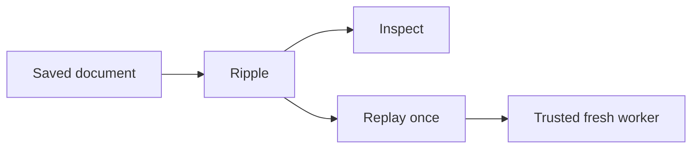

# Ripple

Ripple is a loopback web tool for investigating jolt-sim evidence. It can
inspect a saved document, replay one saved Case/Outcome, and—when you opt
in—provide a persistent Jolt REPL.

Ripple does not implement a scheduler, an application, or a second evidence
format. It presents the data that a scenario already recorded.

[](docs/ripple-persistent-eval-session.png)



## Start Ripple

Copy the example configuration and replace its two absolute paths. The
configuration selects trusted replay settings. The browser cannot replace
them.

```sh
cd viewer
cp example-config.edn viewer-config.edn
# Edit viewer-config.edn before you continue.

JOLT_SIM_VIEWER_TOKEN='use-at-least-32-private-characters' \
  /absolute/path/to/sim-enabled-jolt -M:viewer viewer-config.edn
```

Open the URL printed by the command. Ripple listens on loopback only. The
token is still a capability: with `--eval`, it grants code execution in the
Ripple process. Do not put the token in a configuration file or share it.

To add the REPL pane, use the same command with `--eval`:

```sh
JOLT_SIM_VIEWER_TOKEN='use-at-least-32-private-characters' \
  /absolute/path/to/sim-enabled-jolt -M:viewer --eval viewer-config.edn
```

Use `:port 0` in the configuration when you need an available local port.
Press Ctrl+C in the foreground process to stop Ripple.

## Use the controls

| Control | Use it for | Important limit |
| --- | --- | --- |
| **Inspect** | Open a Trace, Case/Outcome, experiment plan, or official Maelstrom run. | Select the document kind yourself. Ripple does not guess it. |
| **Replay once** | Run the exact scenario, input, and schedule from a Case/Outcome. | It is unavailable for traces, experiment plans, and official-run documents. |
| **Load examples** / **Run new** | Run a preset supplied by the trusted server configuration. | These controls appear only when the launcher supplies a preset catalog. |
| **REPL** | Evaluate one form in the persistent Jolt session. | It exists only with `--eval`; treat its token as a code-execution credential. |
| **Refresh** and retained-worker controls | Inspect or send one explicit command to an application that the launcher attached. | The attached application owns its own commands and lifecycle. |

The browser keeps an uploaded document locally until you choose an action.
Ripple accepts one document-consuming request at a time. This protects the
single replay worker from competing requests.

## Choose a mode

Use the normal viewer mode to inspect evidence. Add a replay configuration only
when you need a trusted fresh worker. Add `--eval` only when you need to run
forms. These choices are independent:

| Need | Configuration |
| --- | --- |
| Inspect documents only | Omit both `:allowed-scenarios` and `:runtime-config`. |
| Inspect and replay | Supply both keys. The checked-in example configuration does this. |
| Inspect and use a REPL | Start with `--eval`; you may omit the replay pair. |

An experiment plan is always inspection-only. Convert a live plan into the
closed viewer document before you upload it. Do not upload a live plan: it can
contain functions and sensitive configuration.

## Examples

The workbenches use Ripple against real application processes:

- [Outbox workbench](../examples/outbox-workbench/README.md) shows a durable
  HTTP → SQLite → TCP/bencode delivery.
- [Broadcast workbench](../examples/maelstrom-broadcast-workbench/README.md)
  shows explicit mailbox delivery and connection control in a three-node
  Broadcast cluster.

For configuration fields, programmatic embedding, retained activity, remote
sessions, test commands, and exact security boundaries, read the
[Ripple implementation details](../docs/research/RIPPLE-IMPLEMENTATION-DETAILS.md).
