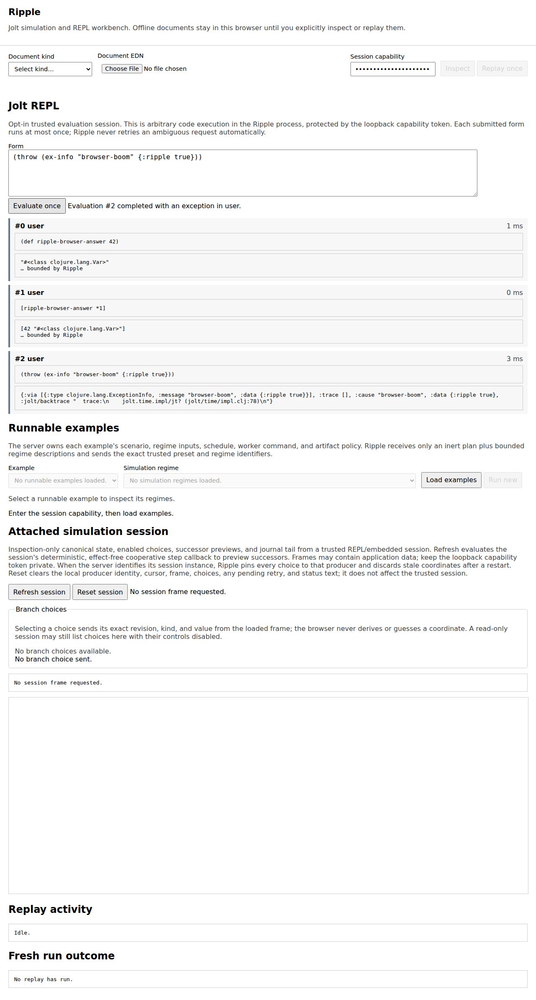

# Ripple

Ripple is the jolt-sim investigation and REPL workbench. Its offline document
viewer remains the default, non-evaluating mode. This optional dependency root
serves a small loopback-only web UI over the existing trace, Case/Outcome, and
read-only official Maelstrom-run reporters, a safe experiment-plan inspector,
and the fresh-process replay
helper. It does not implement another
scheduler, controller, monitor, evidence schema, or worker protocol.

With the explicit command-line `--eval` flag, Ripple also attaches one
persistent `jolt.sim.eval-session` and exposes a small Jolt REPL pane. This is
an adapter over the same UI-neutral, datafy/nav/tap-friendly session API that a
terminal, Glimmer client, or agent can use; the browser is not the evaluator.
Without `--eval`, the arbitrary-code route is absent.

The browser keeps the selected EDN file locally until **Inspect** or **Replay
once** is pressed. Every request requires a startup capability token. The
upload UI requires an explicit document kind -- **Trace**, **Case/Outcome**,
**Experiment plan**, or **Official Maelstrom run** -- and the server never
infers or guesses a schema from the uploaded bytes.
Trace documents render through `jolt.sim.report/trace->html` and are never
replayable; experiment-plan documents render only their safe projection, and
official-run documents reuse the static report's bounded public view model.
Both are also never replayable. Case/Outcome documents render through
`jolt.sim.report/case-outcome->html` and keep the existing replay path. Replay
uses only the scenario, input, and schedule restored from the validated
Case/Outcome document; worker command, working directory, deadlines,
environment, and artifact policy come from the trusted server configuration.
Scenarios must be explicitly allowlisted.

Experiment plans are inspection-only. The process-local map returned by
`jolt.sim.experiment/plan-data` still contains executable handler functions,
probes, projectors, monitors, presenters, and possibly sensitive pack
configuration. It must never be persisted or uploaded. First convert it to
the closed inert viewer document:

```clojure
(require '[jolt.sim.experiment :as experiment]
         '[jolt.sim.viewer.experiment :as viewer-experiment])

(spit "experiment-plan.edn"
      (viewer-experiment/canonical-edn
       (viewer-experiment/plan-data->document
        (experiment/plan-data compiled-plan))))
```

That projection retains only experiment/profile identity, node and port
capabilities, connection endpoints/pack/mode, handler pack ownership and
counts, check identities, runtime FFI mode, and monitor/presentation counts.
It cannot replay, step, perturb, resolve code, or reconstruct an executable
plan. [`examples/experiment-plan.edn`](examples/experiment-plan.edn) is an
inert representative fixture that can be opened in Ripple without compiling a
live plan.

Programmatic and REPL-driven startup may also include a trusted
`:presentation-registry` map. Ripple composes it after jolt-sim's built-in
event presenters, so application entries override library/default displays
without changing the trace or the simulator. This value contains functions
and therefore belongs in ordinary Clojure startup code, not the EDN config
file. Uploaded documents can only select already-registered event-tag,
transition-operation, or canonical transition-site entries; they cannot load
or name presenter code. Presenter implementations must nevertheless treat the
validated event passed to them as untrusted input: they must not evaluate it,
use it to select filesystem paths or native calls, or perform other
input-directed side effects. See the report README for the small presenter
shape.

The server admits one body-consuming inspection or replay request at a time,
even when several tabs share the capability. A competing request receives 429
before its body is read. Two bounded HTTP threads let jolt-http's parser keep
feeding that one request while its handler consumes a segmented body; this
does not permit a second replay process.

Copy [`example-config.edn`](example-config.edn), replace the absolute paths,
and start the viewer with the sim-enabled Jolt image:

```sh
cd viewer
JOLT_SIM_VIEWER_TOKEN='replace-with-at-least-32-random-characters' \
  /absolute/path/to/sim/jolt -M:viewer /absolute/path/to/viewer-config.edn
```

To opt into the persistent Jolt REPL, add `--eval` before the config path:

```sh
cd viewer
JOLT_SIM_VIEWER_TOKEN='replace-with-at-least-32-random-characters' \
  /absolute/path/to/sim/jolt -M:viewer --eval \
  /absolute/path/to/viewer-config.edn
```

The browser submits exactly one opaque form string per request and never
selects a namespace, history policy, function, or runtime option. Successful
forms and evaluated exceptions both return a committed sequence receipt;
printed values and output are bounded display text. Ripple never retries an
evaluation automatically when the transport or receipt is ambiguous. The
capability token grants arbitrary code execution in the Ripple process, so
keep it private even though the listener is loopback-only.

### Evaluation/document-inspection-only workbench

`:allowed-scenarios` and `:runtime-config` are an all-or-nothing replay pair.
Supplying both enables the fresh-process replay/run workbench described below,
exactly as before. Omitting **both** keys instead starts Ripple as an explicit
evaluation/document-inspection-only workbench: rendering and an injected
`:evaluate-form!` service keep working, while authorized `/api/run`,
`/api/replay`, `/api/replay-progress`, and `/api/run-presets` fail closed as
unavailable (`:run-config-unavailable`, `:replay-unavailable`,
`:replay-progress-unavailable`, and `:run-presets-unavailable`) before any
request body is read or any service is invoked. Unauthorized requests to those
routes still answer `403`. Supplying only one of the two keys is rejected at
startup, and a nonempty `:run-presets` catalog is rejected without the replay
pair because every preset resolves to coordinates only a fresh worker can
execute. This mode is for inspecting retained documents and driving the
persistent Jolt REPL without granting any fresh-process execution capability.

[](docs/ripple-persistent-eval-session.png)

Port `0` selects an ephemeral loopback port and the startup message prints the
actual URL. A fixed port such as `8788` is more convenient for repeated use.
Press Ctrl+C in the foreground viewer process to stop the listener and handler
pool cleanly; the command-line entry point owns SIGINT and runs server shutdown
before exiting.

The Linux CI gate exercises that real signal path in a fresh process and
retains the config, stdout, and stderr for every run:

```sh
JOLT_SIM_BIN=/absolute/path/to/sim/jolt \
JOLT_SIM_PROJECT_DIR=/absolute/path/to/jolt-sim \
  test/cli-sigint-smoke.sh
```

The configuration is deliberately closed. Ambient replay keys are limited to
the public process-explorer settings; browser data cannot replace them. The
example retains completed worker directories as well as failures because the
viewer is an investigation tool. `:temp-dir` is the existing parent under
which the process explorer creates one isolated run directory; it is not an
output directory chosen by the uploaded document.

Current boundary: inspection is a real report render (trace documents through
the trace report, Case/Outcome documents through the Case/Outcome report, and
safe experiment-plan projections through specialized presentation kinds), and
replay delegates to one real fresh worker for Case/Outcome documents only.
Hosted CI drives the checked-in canonical outbox Case/Outcome through the live
viewer HTTP API, executes its unchanged HTTP/SQLite/TCP/bencode scenario in
that worker, and retains the complete worker directory plus an append-only
phase log. Ripple also exposes the trusted, application-defined runnable
catalog described below. The UI does not yet compare two outcomes, evaluate
post-hoc invariants, or discover catalogs dynamically from running
applications. Those are later viewer slices over the same evidence and
execution APIs.

### Run a trusted example

Ripple can start a canonical example without first uploading a retained
Case/Outcome. **Load examples** fetches the server's closed v2 preset/regime
catalog, and **Run new** starts the exact selected pair in one fresh worker. The first
executable preset is **Outbox: cancel before acknowledgment**:
the ordinary compiled HTTP -> SQLite -> TCP/bencode outbox application under
the truthful `:hermetic` profile. The application and its library adapters run
unchanged; Ripple does not reimplement their HTTP, database, networking, codec,
or cancellation behavior.

The second executable preset is **Maelstrom Echo: init and echo round trip**:
the existing ordinary `jolt.maelstrom.fixtures.echo-scenario/echo-roundtrip`
defsim scenario under the same truthful `:hermetic` profile. One fresh worker
runs the unchanged `jolt.maelstrom.node` boundary, `jolt.maelstrom.echo`
handler, and `jolt.maelstrom.transport.memory` endpoints over one exact
nested Unicode echo input; Ripple does not reimplement node, Echo, or
transport behavior. Its inert plan projection is the checked-in two-endpoint
topology [`examples/maelstrom-echo-plan.edn`](examples/maelstrom-echo-plan.edn):
a client and a node joined by the simulated request and reply connections,
with zero FFI handler packs. The preset carries no schedule, so the run
drives no `:future-schedule` override, and it reuses the same trusted fresh
worker command as the outbox preset -- that existing worker alias already
resolves the scenario from this repository's own source and test roots.

The third preset, **Outbox: first-poll regime lab**, runs the unchanged
`exercise-reopen-with-capacities` scenario. Its ten application-owned regimes
are the exact cross product of receiver-first versus HTTP-first initial poll
admission and no modeled EINTR versus EINTR at poll ordinal 1, 2, 4, or 8.
Each description names its limited scope: the coordinator controls admission
at those two first-poll boundaries, not arbitrary thread execution or poll
completion order. Its distinct inert plan projection is
[`examples/outbox-regime-lab-plan.edn`](examples/outbox-regime-lab-plan.edn).

The fourth preset, **Maelstrom Broadcast: healthy line and partition/heal**,
runs the unchanged
`jolt.maelstrom.fixtures.broadcast-scenario/broadcast-partition-heal` defsim
scenario: the real `jolt.maelstrom.broadcast` application slice on unchanged
`jolt.maelstrom.node` instances over the in-memory transport, in the fixed
n1 -- n2 -- n3 line topology. Its two regimes are exactly the scenario's two
accepted inputs: the healthy unpartitioned line, and the n2 -- n3 link
partitioned until the post-broadcast heal so the application's real
`retry-pending!` resends the retained delivery with its exact msg_id. Ripple
does not interpret the fault or reimplement Broadcast, node, or transport
behavior. Its inert plan projection is
[`examples/maelstrom-broadcast-plan.edn`](examples/maelstrom-broadcast-plan.edn):
a client and the three cluster nodes joined by the ten truthful directed
request/reply connections of the line, with no n1 -- n3 edge. The preset
carries no schedule and reuses the same trusted fresh worker command as the
outbox preset.

The fifth preset, **Outbox: JSON idempotency replay/conflict lab**, runs the
existing marked
`jolt.sim.fixtures.outbox-json-delivery-scenarios/exercise-replay-or-conflict`
scenario: two ordinary routed-JSON request cycles through the unchanged
production `jolt.example.outbox.http-json` facade on one hermetic SQLite
connection, then the unchanged framed TCP/bencode delivery, correlated-ack
validation, and ack-gated durable marking. Its two regimes are exactly the
scenario's two accepted modes over one fixed canonical command: **exact
replay**, where the second request carries the same command value and must
return 200 with the same response-body octets and no second emission, and
**conflict**, where the
second request reuses the request id with a different payload and must return
the exact 409 `request-id-conflict` envelope without authorizing a second
command. Both regimes require equal decoded durable-state snapshots across
the second request and exactly one delivery and mark. Ripple does not
reimplement the facade, idempotency, database, networking, or codec behavior.
Its inert plan
projection is
[`examples/outbox-json-idempotency-plan.edn`](examples/outbox-json-idempotency-plan.edn):
the same four-node client/app/receiver/SQLite outbox topology. The preset
carries no schedule and reuses the same trusted fresh worker command as the
other presets.

The browser is not an execution-coordinate editor. A trusted startup preset
owns its allowlisted scenario symbol, exact optional schedule, runtime profile,
and nonempty finite regime catalog; each regime owns one canonical input
snapshot. `GET /api/run-presets` publishes catalog version 2 with preset ID,
label, profile ID, validated inert experiment-plan EDN, and each regime's ID,
label, bounded summary, and namespaced scope. It never publishes an input or
schedule. `POST /api/run` accepts exactly the integer version 2 plus the
selected preset and regime IDs. Scenario, input, schedule, worker command,
working directory, deadlines, environment, and artifact policy therefore
remain server-owned and cannot be replaced by browser data. Run and replay
share the same single-flight admission, progress model, path redaction,
retained activity, and outcome handling. Preset runs also retain the trusted
catalog version, preset ID, regime ID, and declared scope in active and
terminal progress, including launch failures, so a forensic record never has
to infer the selected regime from mutable browser state.

For these presets, start Ripple programmatically from a project REPL or a
small launcher namespace so the trusted configuration can read the checked-in
plans without duplicating them in the command-line EDN file:

```clojure
(require '[jolt.example.outbox.regimes :as outbox-regimes]
         '[jolt.sim.viewer :as viewer]
         '[jolt.sim.viewer.experiment :as viewer-experiment])

(defn outbox-lab-regimes []
  (mapv (fn [{:keys [id label summary scope]}]
          {:id id
           :label label
           :summary summary
           :scope scope
           :input (outbox-regimes/scenario-input id)})
        outbox-regimes/regimes))

(def ripple
  (viewer/start!
   {:port 8788
    :capability-token (System/getenv "JOLT_SIM_VIEWER_TOKEN")
    :max-document-bytes 1048576
    :allowed-scenarios
    #{'jolt.sim.fixtures.outbox-experiment-scenarios/exercise-cancel-before-ack-compiled
      'jolt.maelstrom.fixtures.echo-scenario/echo-roundtrip
      'jolt.sim.fixtures.outbox-delivery-scenarios/exercise-reopen-with-capacities
      'jolt.maelstrom.fixtures.broadcast-scenario/broadcast-partition-heal
      'jolt.sim.fixtures.outbox-json-delivery-scenarios/exercise-replay-or-conflict}
    :run-presets
    [{:id :jolt.sim.preset/outbox-cancel-before-ack-v1
      :label "Outbox: cancel before acknowledgment"
      :scenario
      'jolt.sim.fixtures.outbox-experiment-scenarios/exercise-cancel-before-ack-compiled
      :profile-id :hermetic
      :schedule nil
      :regimes
      [{:id :jolt.sim.regime/outbox-cancel-before-ack-canonical
        :label "Canonical cancellation"
        :summary "Cancel the compiled outbox delivery before acknowledgment."
        :scope [:jolt.example.outbox/cancellation]
        :input {:payload [0 127 128 255]
                :stream-capacity 8
                :pipe-capacity 1
                :poll-eintr-ordinal nil}}]
      :plan-document
      (viewer-experiment/read-edn
       (slurp "examples/outbox-cancel-before-ack-plan.edn"))}
     {:id :jolt.sim.preset/maelstrom-echo-roundtrip-v1
      :label "Maelstrom Echo: init and echo round trip"
      :scenario 'jolt.maelstrom.fixtures.echo-scenario/echo-roundtrip
      :profile-id :hermetic
      :schedule nil
      :regimes
      [{:id :jolt.sim.regime/maelstrom-echo-canonical
        :label "Canonical Unicode round trip"
        :summary "Round-trip one nested Unicode payload through Maelstrom Echo."
        :scope [:jolt.maelstrom.echo/round-trip]
        :input {"greeting" "héllo, 世界 🌍"
                "lang" "日本語"
                "nested" {"a" "ελληνικά"
                          "b" [" 한글 " "português" 42 nil]}
                "emoji" "🚀"}}]
      :plan-document
      (viewer-experiment/read-edn
       (slurp "examples/maelstrom-echo-plan.edn"))}
     {:id :jolt.sim.preset/outbox-first-poll-regime-lab-v1
      :label "Outbox: first-poll regime lab"
      :scenario
      'jolt.sim.fixtures.outbox-delivery-scenarios/exercise-reopen-with-capacities
      :profile-id :hermetic
      :schedule nil
      :regimes (outbox-lab-regimes)
      :plan-document
      (viewer-experiment/read-edn
       (slurp "examples/outbox-regime-lab-plan.edn"))}
     {:id :jolt.sim.preset/maelstrom-broadcast-partition-heal-v1
       :label "Maelstrom Broadcast: healthy line and partition/heal"
       :scenario
       'jolt.maelstrom.fixtures.broadcast-scenario/broadcast-partition-heal
       :profile-id :hermetic
       :schedule nil
       :regimes
       [{:id :jolt.sim.regime/maelstrom-broadcast-healthy
         :label "Healthy three-node line"
         :summary "Run Broadcast on the unpartitioned n1-n2-n3 line."
         :scope [:jolt.maelstrom.broadcast/link-partition-selection]
         :input {:message 42 :partition-links []}}
        {:id :jolt.sim.regime/maelstrom-broadcast-partition-heal
         :label "Partition n2-n3, heal, retry"
         :summary "Partition n2-n3 until the post-broadcast heal."
         :scope [:jolt.maelstrom.broadcast/link-partition-selection]
         :input {:message 42 :partition-links [["n2" "n3"]]}}]
       :plan-document
       (viewer-experiment/read-edn
        (slurp "examples/maelstrom-broadcast-plan.edn"))}
      {:id :jolt.sim.preset/outbox-json-idempotency-lab-v1
       :label "Outbox: JSON idempotency replay/conflict lab"
       :scenario
       'jolt.sim.fixtures.outbox-json-delivery-scenarios/exercise-replay-or-conflict
       :profile-id :hermetic
       :schedule nil
       :regimes
       [{:id :jolt.sim.regime/outbox-json-exact-replay
         :label "Exact replay of the accepted command"
         :summary "Replay the same accepted command value."
         :scope [:jolt.example.outbox/request-id-reuse]
         :input {:mode :exact-replay
                 :payload [0 127 128 255]
                 :request-id "req-1"
                 :entity-id "entity-a"}}
        {:id :jolt.sim.regime/outbox-json-conflict
         :label "Conflicting reuse of the request id"
         :summary "Reuse the request id with a different payload."
         :scope [:jolt.example.outbox/request-id-reuse]
         :input {:mode :conflict
                 :payload [0 127 128 255]
                 :request-id "req-1"
                 :entity-id "entity-a"}}]
       :plan-document
       (viewer-experiment/read-edn
        (slurp "examples/outbox-json-idempotency-plan.edn"))}]
    :runtime-config
    {:worker-command [(System/getenv "JOLT_SIM_BIN")
                      "-M:outbox-delivery-explore-worker"]
     :dir "/absolute/path/to/jolt-sim"
     :timeout-ms 60000
     :startup-timeout-ms 120000
     :kill-grace-ms 500
     :temp-dir "/absolute/path/to/retained-runs"
     :retain-completed-artifacts? true
     :activity-journal? true}}))
```

Run that form with the process working directory set to `viewer`, an absolute
`JOLT_SIM_BIN`, a writable retained-run parent, and a capability token of at
least 32 characters. The `-M:viewer` command-line path remains available: put
the same closed maps in the EDN configuration and inline the contents of
[`examples/outbox-cancel-before-ack-plan.edn`](examples/outbox-cancel-before-ack-plan.edn)
[`examples/maelstrom-echo-plan.edn`](examples/maelstrom-echo-plan.edn),
[`examples/outbox-regime-lab-plan.edn`](examples/outbox-regime-lab-plan.edn),
[`examples/maelstrom-broadcast-plan.edn`](examples/maelstrom-broadcast-plan.edn),
and
[`examples/outbox-json-idempotency-plan.edn`](examples/outbox-json-idempotency-plan.edn)
as `:plan-document`.

The UI renders the selected preset's topology before execution -- four nodes
and three connections for the outbox and JSON idempotency presets, the two
endpoints and two simulated connections for Maelstrom Echo, the four endpoints
and ten directed
request/reply connections for Maelstrom Broadcast -- then uses the existing
progress, retained semantic activity, and terminal outcome views for the run:

[](docs/ripple-run-new-outbox.png)

The Playwright fixture also captures
`target/ripple-playwright/outbox-regime-lab-selection.png` after selecting the
HTTP-first / first-poll-EINTR regime,
`select-maelstrom-broadcast-partition.png` under `test-results` after selecting
and submitting the Broadcast partition/heal coordinate, and
`run-new-outbox-json-conflict.png` under `test-results` after selecting and
submitting the JSON idempotency conflict coordinate through the
deterministic browser fixture. That browser lane proves the catalog, topology,
selection, and request UI; the real fresh-worker E2E is the separate execution
proof. Generated browser artifacts remain CI outputs rather than checked-in
source images.

Each fresh run is an interactive application witness, **not** the existing
two-worker real/hermetic parity proof. Regime selection is finite and
server-owned; arbitrary browser-edited inputs and a second independently
truthful execution profile remain later slices. The UI does not advertise a
scope or distinction that the selected worker scenario cannot enforce.

### Replay activity panel

While a replay runs, the page polls the authenticated `GET
/api/replay-progress` endpoint and renders a small "Replay activity" panel
below the report. This is an ephemeral progress view over the *same* single
fresh-process replay started by **Replay once** -- it is not a second replay
implementation, a scheduler, or an evidence store.

The endpoint never accepts a filesystem path (or any other input) from the
browser. It reports the one server-owned active/most-recent replay by reading
only fixed basenames from the trusted run directory that
`jolt.sim.process-explorer` already creates for that replay: `worker-ready.edn`
and -- existence only, never parsed -- `result.edn` as milestones, and up to
65536 bytes each of `stdout.log`/`stderr.log`. Active responses expose the
last milestone as the boolean `result-observed?`, allowing a client or test to
distinguish a genuinely in-flight worker from a child that has already written
its result while the supervising POST is still unwinding. A file may be
missing or partially written at any moment; both are tolerated. The response is JSON
(`Content-Type: application/json`) with `Cache-Control: no-store`, exactly
like every other viewer response, and requires the same capability token and
loopback binding as `/api/render` and `/api/replay`.

The reported `status` is one of a small closed set: `idle` (no replay has
run), `starting` (accepted; the worker is not yet confirmed alive),
`worker-ready` (the worker's readiness marker exists), `running` (readiness
and/or output is observable), `completed`, or `failed`. The terminal snapshot
reuses the exact bounded stdout/stderr diagnostics process-explorer already
captured before its own artifact cleanup ran, so it renders correctly even
when `:retain-completed-artifacts?` is false and the run directory has since
been removed. The browser renders every dynamic string through `textContent`
only and polls at most one request at a time. Polling continues until the
authoritative replay POST settles, then performs one final snapshot fetch.
Non-final polls render only active statuses, so the previous replay's idle or
terminal snapshot cannot replace the new replay's local `starting` state even
if a fresh progress GET reaches the server before its replay POST. A generation
token discards older in-flight poll responses, and the file, capability,
inspect, and replay controls remain disabled for the complete request so a
second click cannot stop observation of the first replay.

The E2E gate uses an optional trusted observer in the ordinary outbox fixture.
That observer writes a retained checkpoint only after the real HTTP command
has committed to SQLite and the pending row has been reloaded and validated,
but before delivery attempt 1. The parent then samples the authenticated
endpoint, requires `result-observed?` to be false, writes a retained release
record, and requires the same worker's normal Case/Outcome completion. The
default fixture and scenario path supply no observer and remain unchanged; the
viewer does not reimplement HTTP, SQLite, TCP, bencode, or application logic.

When trusted startup configuration also enables `:activity-journal?` and
completed-artifact retention, the terminal progress response pages the same
append-only semantic activity retained by the process supervisor. Ripple
renders at most 32 events per explicit page with their sequence, registered
kind, summary, EDN-valued fields, and complete canonical event EDN. **Next** and
**Previous** use the server-issued cursor; the browser validates the requested
cursor, response body, and continuation header together and discards a delayed
page after a new document or replay resets the generation. A presentation that
exceeds the response bound can be skipped using its advancing continuation
without changing the authoritative replay outcome.

The semantic page comes from the public immutable `jolt.sim.activity-view`
model. The HTTP handler and browser are consumers: a REPL, `datafy`/`nav`,
`tap>`, static report, Glimmer client, or other UI can use the same page and
application-owned kind registry without extracting logic from Ripple. The
server retains `:artifact-dir` only as its private read coordinate; neither the
replay response nor activity JSON discloses the host path.

[](docs/ripple-retained-activity.png)

The Playwright acceptance gate uploads a checked-in Case/Outcome through the
real handler, writes a real 40-record journal, proves pages `0..31` and
`32..39` in both directions without gaps or duplicates, rejects a mismatched
coordinate, follows an oversized-page continuation, suppresses a delayed stale
response, and checks every API exchange and the DOM for private path leakage:

```sh
cd viewer
JOLT_SIM_BIN=/absolute/path/to/sim/jolt npm ci
npx playwright install chromium
npm run test:browser
```

Successful screenshots and failure-only trace/video/screenshots are written
under `target/ripple-playwright`; hosted CI uploads that directory even when a
later application or Hegel gate fails.

### In-process session stepping adapter

`jolt.sim.session-view` is a UI-neutral, in-process adapter over one
`jolt.sim.session` Session (the cooperative REPL control capability). It is
not HTTP, a UI, a remote protocol, another scheduler, durable storage, or a
generic effect layer: every branch preview and transition delegates to the
Session, and the adapter owns only the bounded optimistic retry budget that
keeps one read coherent.

`read-frame` returns one coherent, closed frame: the snapshot, the isolated
branch previews, and the append-only journal tail from a validated integer
cursor, all at the same session revision. A concurrent REPL step cannot mix
revisions -- the read retries (bounded) until two consecutive snapshot reads
agree and fails closed with a typed `::coherence-failed` error otherwise. A
malformed or out-of-range cursor fails closed with `::invalid-cursor`.
The returned `:journal/:next-cursor` can be passed to the next read to receive
only entries appended afterward.

`step-frame!` synchronously applies one exact revision-scoped branch and
returns an explicit command-result envelope. A committed result always carries
its plain branch/revision acknowledgment, even if the post-commit frame cannot
be obtained; this prevents an ambiguous retry from executing a command twice.
A stale branch is never silently rebased just because the same action identity
remains enabled: shared state may have changed since the displayed preview.
Instead, the result is `:stale`, carries a refreshed frame, and requires the
human or agent to choose again explicitly.

An embedding may additionally assign the attached producer one process-lifetime
epoch with `:session-instance-id`. The value is 16--128 characters drawn only
from RFC 3986 unreserved ASCII (`A-Z`, `a-z`, `0-9`, `.`, `_`, `~`, and `-`),
must remain stable for that producer lifetime, and should never be reused after
a restart:

```clojure
(def ripple
  (viewer/start-steppable-session!
   (assoc viewer-config
          :session-instance-id "ripple-dev-session-2026-08-07-a")
   sim-session))
```

The epoch is a consistency coordinate, not a credential. The capability token
remains the sole HTTP authority and is always checked first. Every authorized
`GET /api/session-frame` response from a configured producer carries
`X-Jolt-Sim-Session-Instance`; an unauthorized response never does. A
configured `POST /api/session-step` must echo the exact header before Ripple
checks service availability, media type, admission, the request body, or the
trusted step closure. A missing or stale value receives
`409 :session-instance-mismatch` without consuming the body or mutating the
Session. Omitting `:session-instance-id` preserves the original unversioned
in-process protocol.

The browser caches the epoch only from a frame response and sends it with each
choice. A recognized committed receipt remains authoritative and visible even
if the automatic post-commit refresh reaches a different epoch: Ripple
attributes that acknowledgment to the old producer, discards only the new
frame requested with the old cursor, and requires a cursor-zero read of the
new producer.

A network-ambiguous step exposes only **Explicitly retry identical command
(original outcome unknown)** or **Reset session**. Retry preserves both the
exact serialized body and the cached epoch.
If producer A disappeared and restarted producer B now owns the endpoint, that
A-pinned retry receives `409 :session-instance-mismatch`; it is not silently
retargeted to B. That rejection proves only that the retry did not commit; the
original outcome remains unknown until journal reconciliation. Ripple says so
explicitly and enables **Refresh session** for inspection.
That refresh discovers B, discards its first response because the request still
carried A's journal cursor, clears the frame, choices, cursor, and retry, and
requires one fresh cursor-zero read. **Reset session** also forgets the epoch.
This slice prevents a revision-zero restart from masquerading as the earlier
Session.

### Separate-process read-only session attachment

`start-remote-session!` attaches an outer Ripple to an inner Ripple Session
producer without moving Session logic into the viewer. The source coordinate
is closed and loopback-only: the inner port, capability token, expected
process-lifetime epoch, and optional timeout. Each frame read opens
one fresh `teensyp.client` connection, sends the exact cursor, and applies one
absolute monotonic deadline across connect, send, and every receive.

```clojure
(def outer
  (viewer/start-remote-session!
   outer-viewer-config
   {:port 8790
    :capability-token inner-capability-token
    :session-instance-id "inner-session-process-2026-08-07-a"
    :timeout-ms 5000}))
```

The outer viewer's validated `:max-document-bytes` is also the remote frame
body limit, so the proxy cannot accept a document it is forbidden to return.

The client accepts only bounded, exact `Content-Length` HTTP responses. It
rejects transfer encoding, duplicate or malformed headers, truncated or
surplus bodies, unsafe capability header characters, and non-EDN bodies. A
missing or changed inner epoch becomes `409 :session-source-restarted` at the
outer API. It is never silently adopted. The replacement probe necessarily
carries the pinned old epoch and requested journal cursor. Producer B may
compute a read-only frame from that cursor, but the outer viewer validates the
returned producer epoch before parsing, returning, or adopting the frame, so
no B revision or branch coordinate reaches the outer client. Adopting a new
epoch currently requires constructing a new attachment explicitly.

This first remote slice is deliberately read-only. It installs only the same
trusted `cursor -> coherent-frame` service used by the in-process adapter; it
does not proxy `step-frame!`, implement another Session protocol, or add a root
dependency. The Linux acceptance fixture proves the boundary with two
independent live Jolt processes coordinated only by retained control files. It
compares the direct and relayed canonical frames, proves the JSON relay is
read-only and the absent step route cannot mutate the producer, observes one
producer-side step from the next journal cursor without duplication, then
replaces producer A with revision-zero epoch B on A's same port while the outer
process stays alive and proves the pinned attachment returns 409 without
leaking B's frame. Every request, response header/body, readiness marker, and
process transcript is retained:

```sh
JOLT_SIM_BIN=/absolute/path/to/sim/jolt \
  test/remote-session-process-smoke.sh
```

### Separate-process exact stepping and reconciliation

Remote commands are opt-in through a different constructor;
`start-remote-session!` above remains read-only:

```clojure
(def outer
  (viewer/start-remote-steppable-session!
   outer-viewer-config
   {:port 8790
    :capability-token inner-capability-token
    :session-instance-id "inner-session-process-2026-08-07-a"
    :timeout-ms 5000}))
```

The outer still delegates to the inner Session's existing `step-frame!`
semantics. It does not implement a scheduler, rebase a branch, or add an
effect layer. Every command uses the exact closed JSON branch/cursor contract,
one fresh loopback connection, and one monotonic deadline across connect,
send, and receive. The inner verifies authority and the pinned producer epoch
before checking step availability, admission, media type, or consuming the
body. Every authorized step response carries that epoch; an unauthorized
response never does.

The transport sends a command at most once. A complete pinned committed or
stale receipt is authoritative even if closing that connection subsequently
fails. Connect, send, receive, malformed response, and 5xx failures instead
surface as typed `::remote-session/step-outcome-unknown`; they are never
retried automatically. Closed authenticated pre-service rejections are
definitively not committed and retain only their allowlisted status/reason;
the authority-first `403 :forbidden` is also definitive despite intentionally
carrying no producer epoch. An identical explicit retry is protected by the
Session revision: after a commit it is stale and cannot append another
transition, but that stale retry alone is not evidence that an earlier
ambiguous attempt failed to commit.

Agents, REPLs, and alternative UIs can keep the underlying operations as plain
data-oriented functions:

```clojure
(def remote
  (remote-session/attachment source max-frame-bytes))

((:read-frame remote) cursor)
((:step-frame! remote) branch cursor)       ; sends exactly once
((:reconcile-step! remote) branch cursor)   ; reads only
```

Reconciliation must use the original branch and original journal cursor. It
pages the pinned producer's append-only Session journal and returns one closed
status: `:committed` when the command's exact revision slot contains that
branch, `:different` when another command owns the slot, or `:missing` when
the complete observed journal has no such slot. It neither resends the command
nor adopts a replacement producer. Pages must preserve the Session invariant
`revision = journal-count - 1`, cannot regress revision/count, and contain a
recognized start entry followed only by exact revision-aligned step entries.
One call reads at most 64 pages and then fails with typed
`::remote-session/reconciliation-limit-exceeded`. This is process-lifetime
evidence only; crash-safe reconciliation still requires the planned durable
Session journal.

The retained process acceptance campaign now runs both relay modes against
the same producer. It keeps the old read-only route/absence-of-mutation checks,
commits exactly one step through the steppable relay, proves the byte-identical
retry is stale, reconciles the commit from cursor zero, observes exactly one
new journal entry, then replaces producer A with revision-zero producer B on
the same port and proves an A-pinned command cannot mutate B.
